# Documentation – Visite d’exposition

## Exposition

**Titre :** Explore - La science en grand  
**Lieu :** Centre des sciences de Montréal  
**Type :** Exposition permanente, intérieure  
**Date de ma visite :** Mercredi 1er Avril 2026

L'exposition *Explore - La science en grand* au Centre des sciences de Montréal est une exposition permanente entièrement interactive où nous apprenons en expérimentant directement avec notre corps et nos sens. Plutôt que de simplement lire des panneaux, nous touchons, nous manipulons et nous testons nous-mêmes plus de 50 installations. L’idée est de rendre la science concrète et accessible en montrant comment elle s’applique dans la vie de tous les jours. L’exposition est divisée en plusieurs zones qui couvrent différents thèmes, comme le mouvement avec des machines et des engrenages, l’air et ses effets invisibles comme la pression ou le vent, la lumière avec les reflets et les couleurs, et l’eau avec ses courants et ses forces. Il y a aussi des espaces dédiés aux mathématiques, à la matière et à la technologie, où nous pouvons par exemple programmer ou interagir avec des robots. Ce qui rend « Explore » spécial, c’est que tout est conçu pour être vécu activement : nous ne sommes pas de simples spectateurs, nous faisons partie de l’expérience. C’est une façon ludique et immersive de comprendre les bases de la science sans même nous en rendre compte, que nous soyons enfants ou adultes.

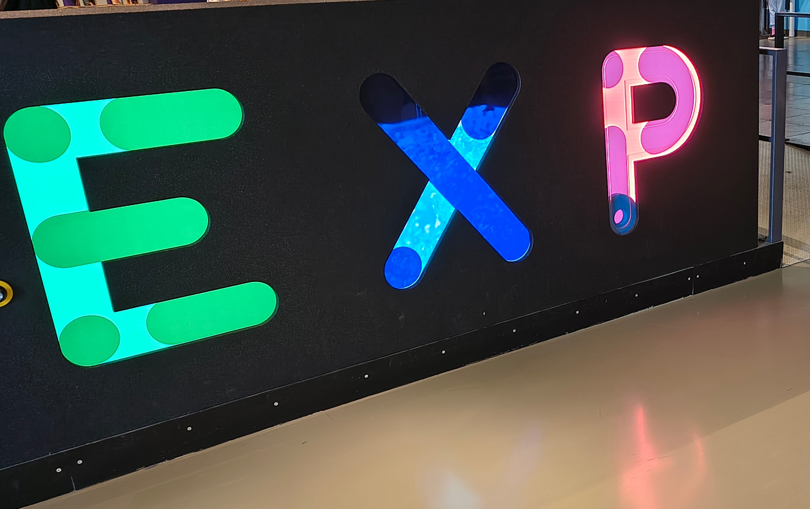 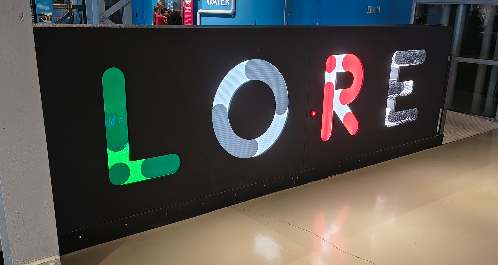 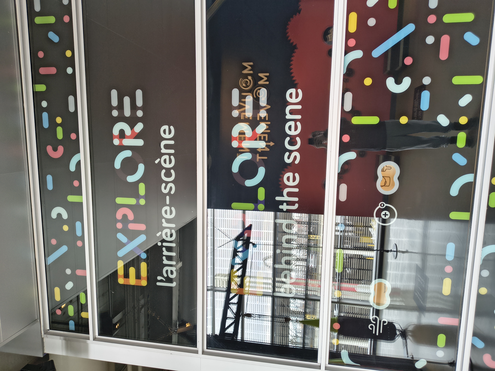

---

# Oeuvre choisie

## Intelligente, la conduite?

**Artistes :** TKNL, Ubisoft, Pratt & Whitney et Element AI

**Année de réalisation :** 2019 ou 2020

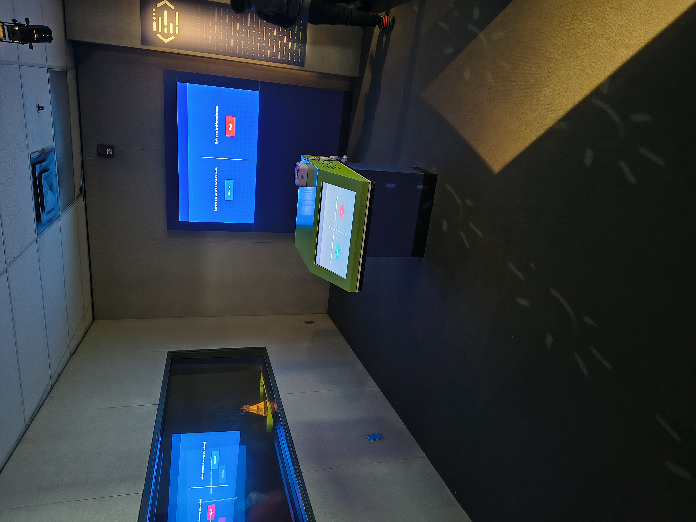 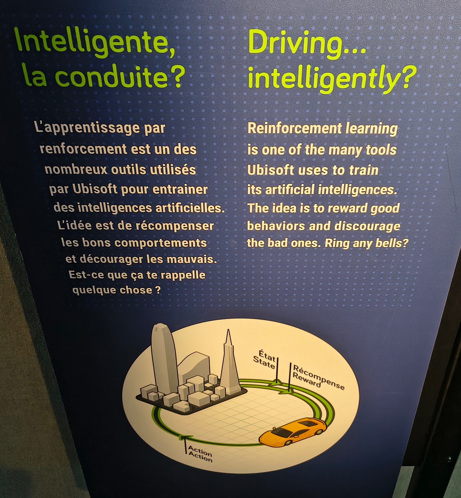 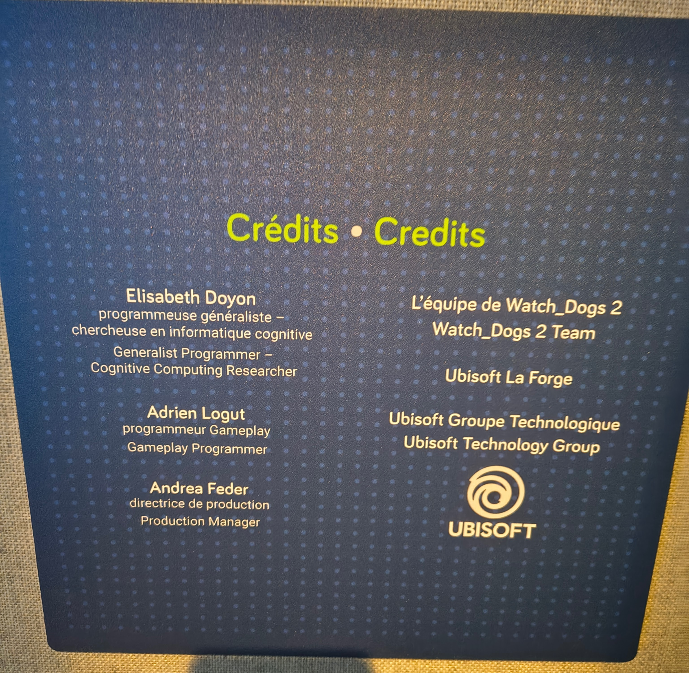

---

## Description du dispositif

*Intelligente, la conduite* est aménagée dans une petite salle fermée et sombre, structurée autour d'un poste de pilotage central et d'un grand écran de diffusion mural. Le cœur du dispositif est un pupitre de commande incliné sur lequel est encastré un écran tactile affichant une interface de réglages composée de curseurs horizontaux. Cet écran sert d'unité de saisie pour modifier les variables de la simulation, comme le style de conduite, la détection des obstacles, la durée de l'entrainement, le type de freinage et la couleur de la voiture. Face à ce pupitre, une projection murale grand format affiche l'environnement de test. La voiture y est représentée en vue de dessus, entourée de zones de détection colorées qui s'étendent devant elle pour balayer la trajectoire. Lorsqu'une session est lancée, on observe le véhicule avancer de manière autonome sur une piste. Si les paramètres de vitesse saisis sur le pupitre permettent au logiciel de détecter les obstacles et de freiner à temps, la voiture complète son parcours avec succès. À l'inverse, si la vitesse dépasse les capacités de freinage du système, le véhicule percute un obstacle. Selon le résultat, un message de victoire ou un message de défaite s'affiche simultanément sur le pupitre et le mur pour clore la partie.

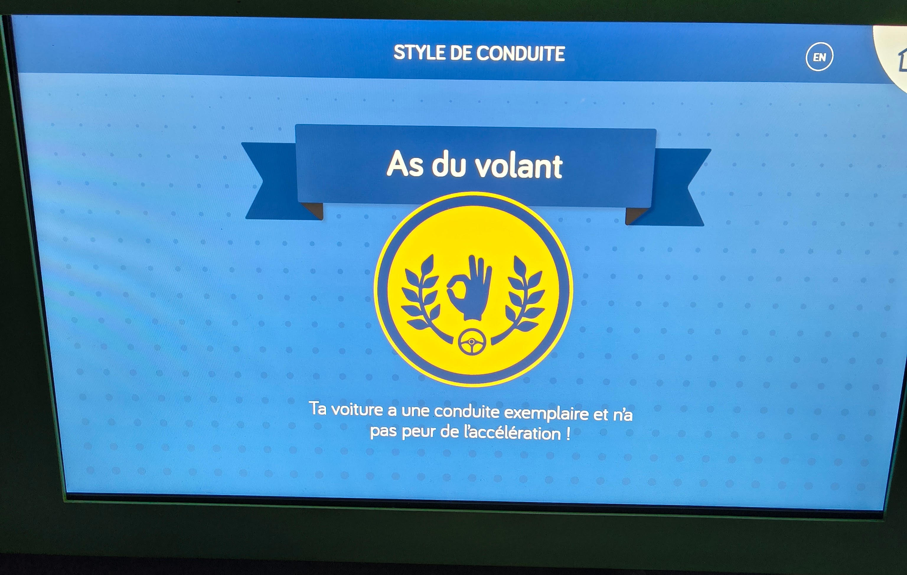

---

## Type d’installation

Je définis ce projet comme une installation interactive, technologique et immersive. L'aspect interactif est au cœur de l'expérience, car c'est mon intervention sur les paramètres qui dicte le comportement de la voiture. L'immersion est renforcée par l'aménagement d'une salle dédiée, isolée du reste de l'exposition par des parois sombres et un éclairage tamisé.

---

## Fonction du dispositif multimédia

D'après mon analyse, ce dispositif remplit plusieurs rôles complémentaires qui enrichissent l'expérience. Sa fonction principale est avant tout pédagogique, puisqu'il me permet de démystifier les bases de l'intelligence artificielle, notamment les concepts d'apprentissage et d'exécution, par le biais d'une expérimentation concrète et immédiate. En plus de cet aspect éducatif, le système agit comme un simulateur technique capable de reproduire un environnement de test sécurisé où je peux observer sans risque les conséquences réelles de mes décisions algorithmiques. Enfin, j'ai remarqué une fonction scénographique importante : l'utilisation stratégique des rubans LED bleus et la disposition monumentale des écrans créent une esthétique de laboratoire futuriste qui a immédiatement capté et retenu mon attention tout au long de l'activité.

---

## Mise en espace

J'ai observé une organisation spatiale très rigoureuse, pensée pour maximiser mon immersion et ma concentration. L'expérience débute dans une petite salle dédiée qui agit comme une capsule, me coupant efficacement des stimuli sonores et visuels du reste de l'exposition. Au centre de cet espace, le poste de contrôle est constitué d'un écran tactile monté sur un socle robuste et incliné, une disposition qui m'a permis de manipuler les réglages tout en gardant un contact visuel constant avec la projection. Juste en face, le mur de diffusion occupe une place prépondérante ; l'écran géant est situé à une distance idéale pour que je puisse saisir tous les détails de la simulation, comme les faisceaux de détection, sans avoir à détourner le regard ou à bouger la tête.

---

## Composantes et techniques

En observant attentivement l'installation et les crédits, j'ai identifié les éléments suivants :

- Interface utilisateur (UI) : Un écran tactile central gérant l'interface de programmation.

- Logiciel de simulation : Un moteur de jeu (probablement Unity) gérant la physique de la voiture et l'IA.

- Structure physique : Un support d'écran central sur mesure et des parois de salle acoustiques.

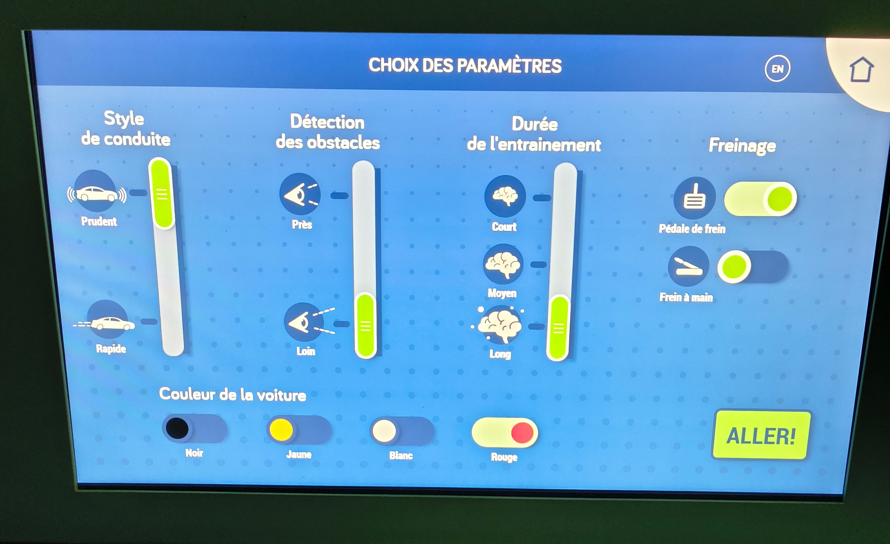 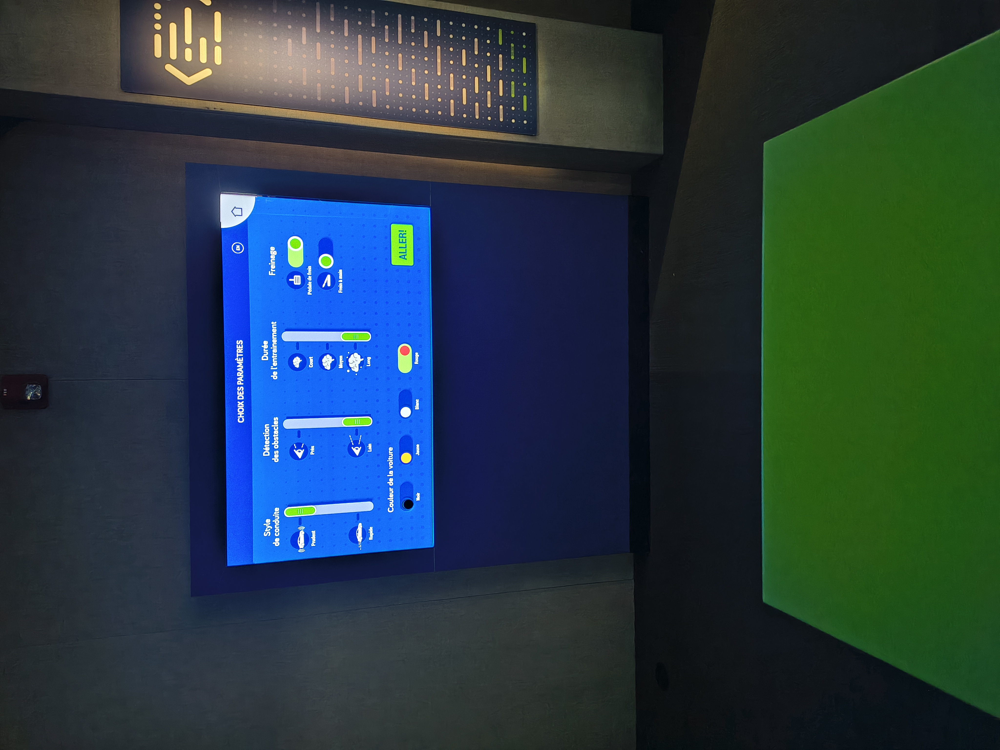 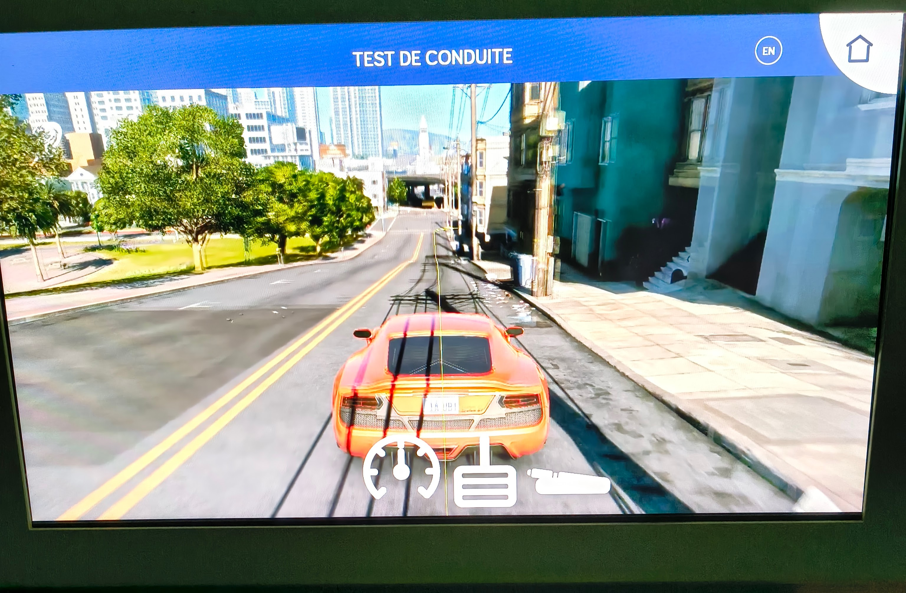 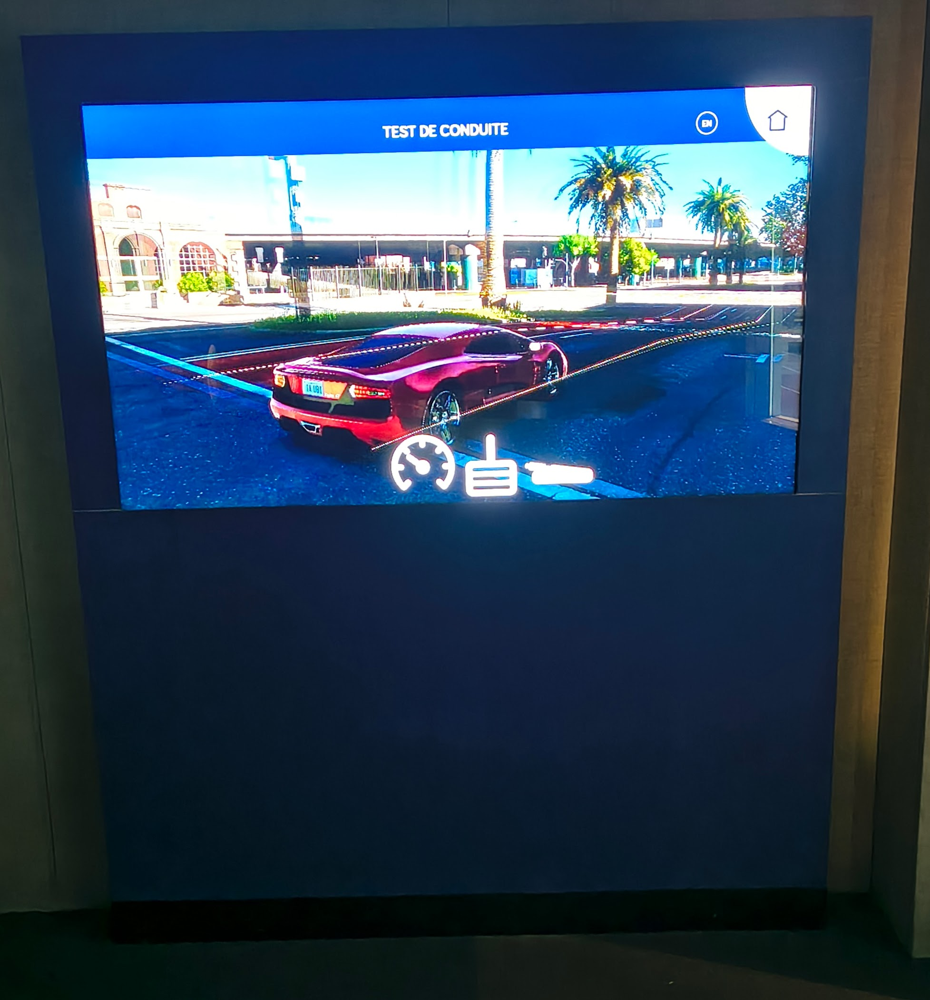

---

## Éléments nécessaires à la mise en exposition

Pour que cette installation fonctionne dans un milieu muséal, j'ai noté que ces éléments étaient essentiels :

- Mobilier technique : Un socle stable pour l'écran de contrôle capable de supporter une utilisation intensive par le public.

- Infrastructure réseau et électrique : Tous les câblages sont dissimulés dans les parois ou sous le plancher pour des raisons de sécurité et d'esthétique.

- Signalétique : Des panneaux à l'extérieur de la salle pour indiquer le nom du dispositif et les crédits de production.

- La salle dédiée (cloisonnement) : Il est nécessaire de construire une pièce fermée ou une capsule pour isoler le dispositif du reste de l'exposition, tant pour la gestion de la lumière que pour le calme nécessaire à la simulation.

- Éclairage asservi : Des lumières styles dorés fixés au plafond qui complètent l'ambiance visuelle.

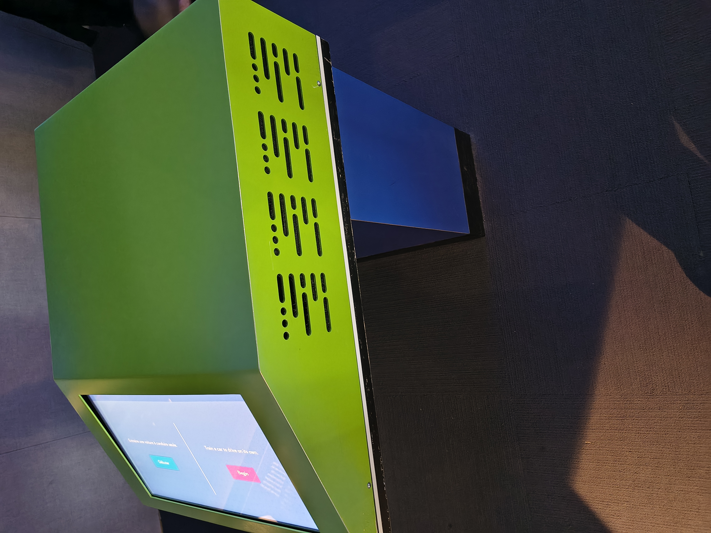 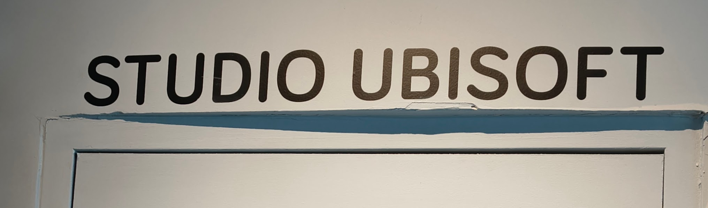 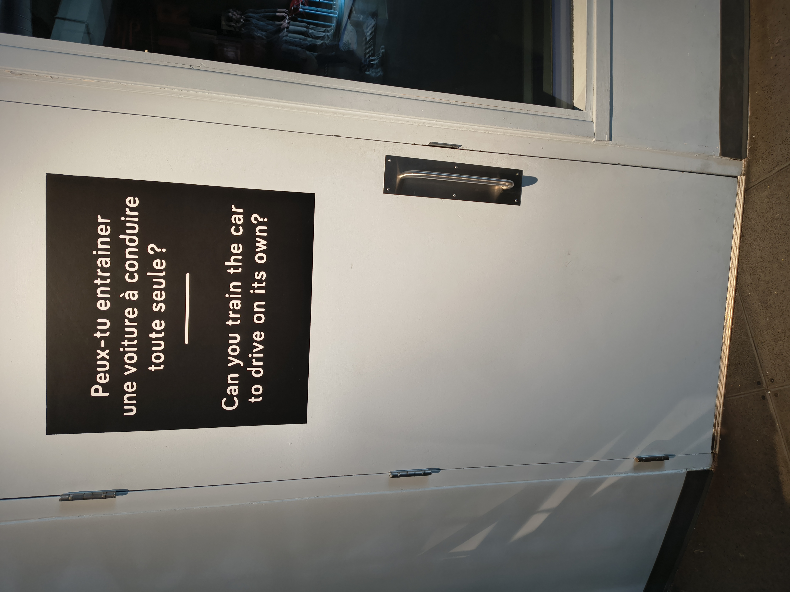 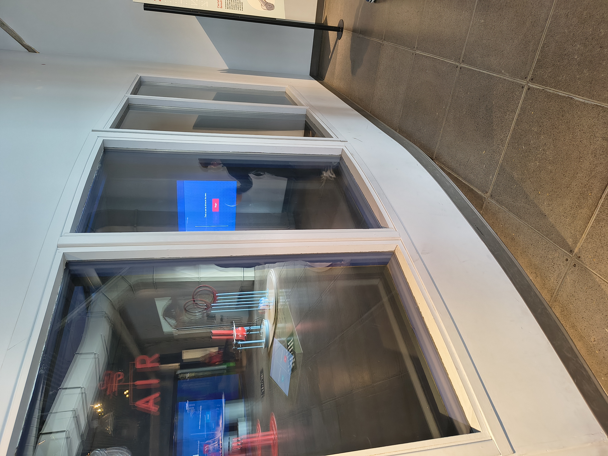 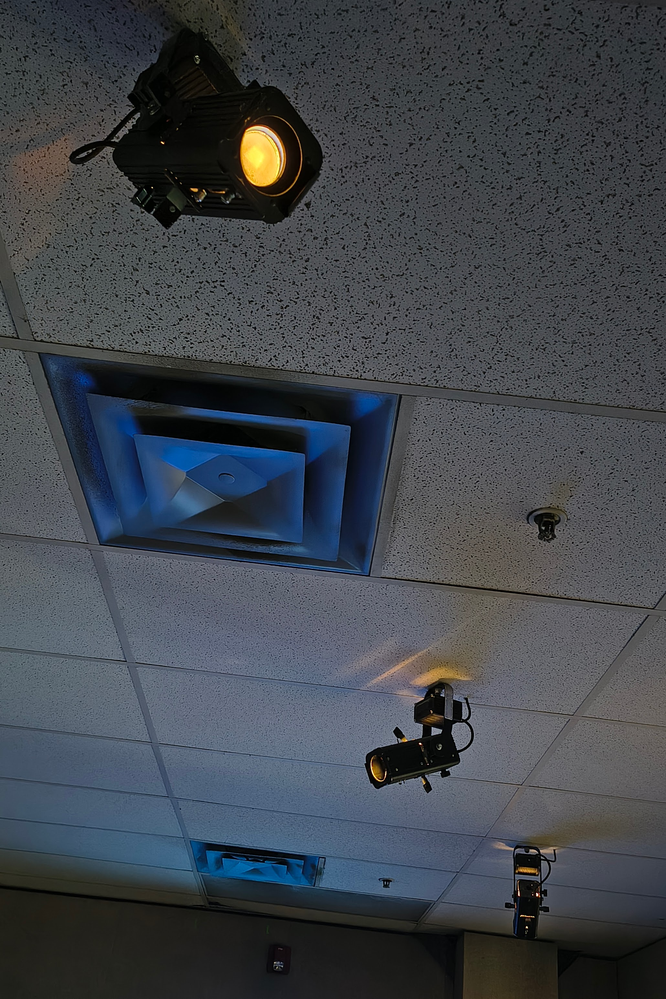

---

## Expérience vécue

J'ai trouvé la progression de l'expérience très fluide. Le fait d'entrer physiquement dans la salle crée une rupture avec le reste de l'exposition et me met immédiatement dans un état de concentration. J'ai ressenti un sentiment de contrôle en manipulant les curseurs, suivi d'une certaine tension au moment de lancer la simulation pour voir si ma configuration allait réussir.

---

## Ce qui m’a plu

Ce qui m'a le plus séduit, c'est la clarté visuelle de la simulation sur le grand écran. Voir les faisceaux de détection de la voiture m'a permis de comprendre "comment elle voit". De plus, l'écran affiché pour dire qu'on a perdu après un accident est très efficace : il m'a donné envie de recommencer immédiatement pour corriger mes erreurs, ce qui rend l'interaction très addictive.

---

## Ce que je ferais autrement

Si je devais suggérer une amélioration, je commencerais par clarifier le nom officiel du dispositif. Tout au long de mon expérience, je me suis questionné sur son appellation exacte (« Intelligente, la conduite »), car elle me semblait un peu ambiguë par rapport au fonctionnement technique observé. J'aurais donc mis en place une signalétique plus percutante et explicite dès l'entrée de la salle. Sur le plan de l'interaction, j'ajouterais également un retour sonore plus dramatique lors de l'accident (un bruit d'impact localisé) pour renforcer le sentiment de défaillance de l'IA. Enfin, l'ajout d'un bouton de « Rejouer » physique sur le socle central permettrait de relancer la simulation plus rapidement, rendant le cycle d'apprentissage par l'erreur encore plus dynamique.

---

## Références

Photos : Vincent Quesnel  
Exposition : Centre des sciences de Montréal  
Artiste : TKNL, Ubisoft, Pratt & Whitney et Element AI 

Oeuvre : Intelligente, la conduite?

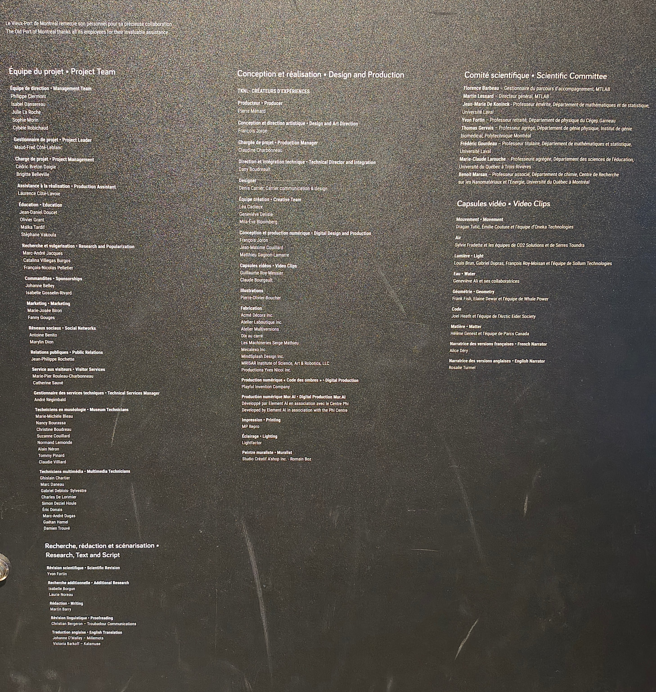 

Liens consultés : [Centre des sciences de MTL, exposition](https://www.centredessciencesdemontreal.com/exposition-permanente/explore) [Communiqué de presse, exposition Explore](https://www.centredessciencesdemontreal.com/sites/default/files/inline-files/communique_exploreprixcascade_csm_fr_20210924_vf_1_0.pdf)
