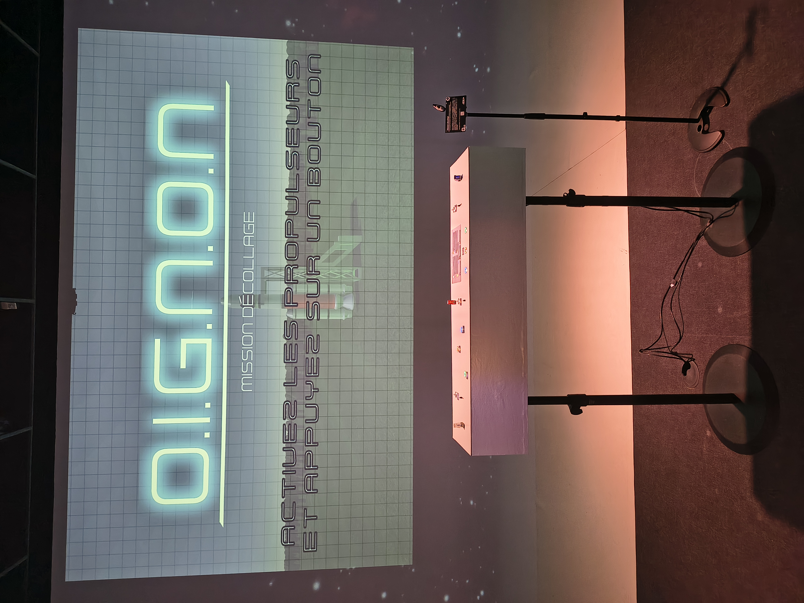
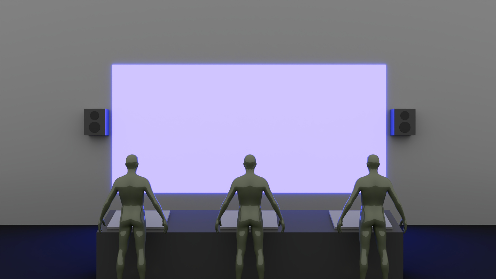
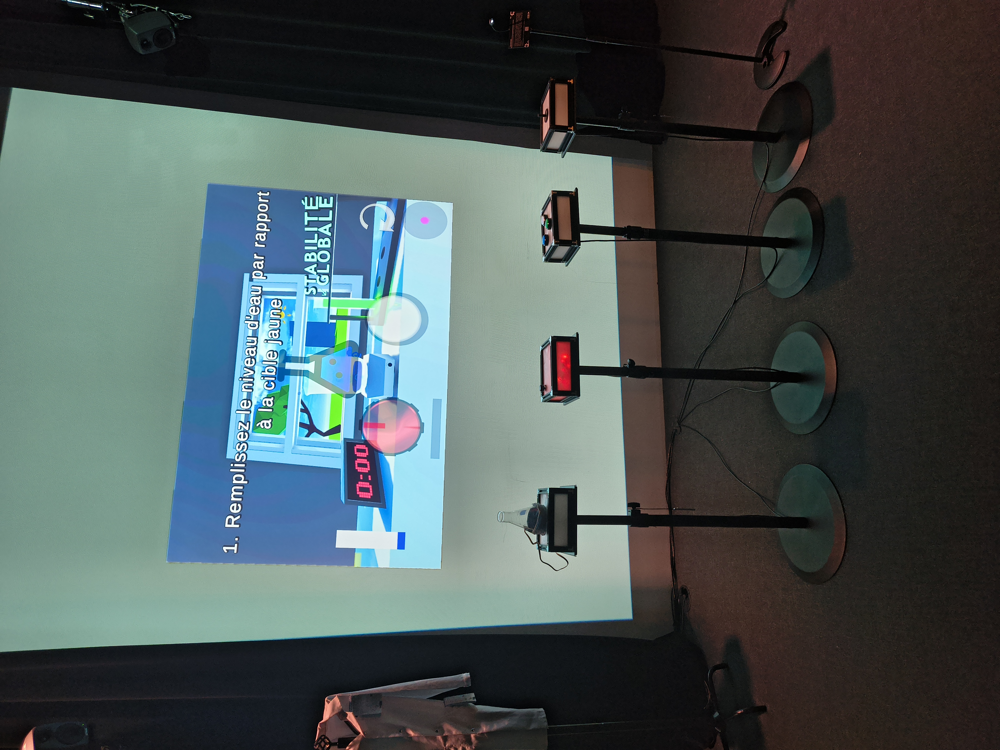
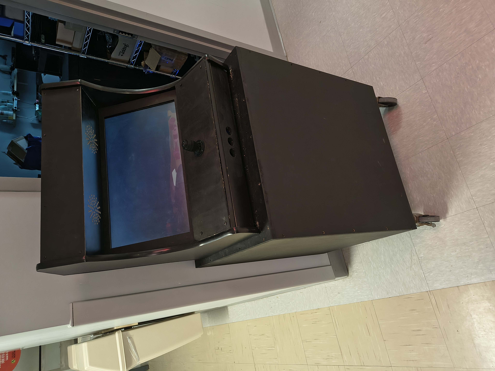
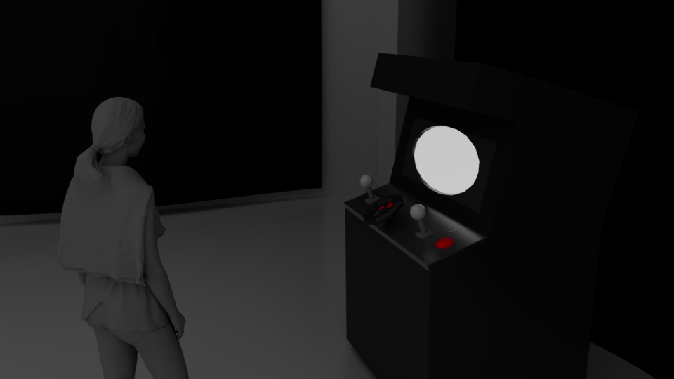
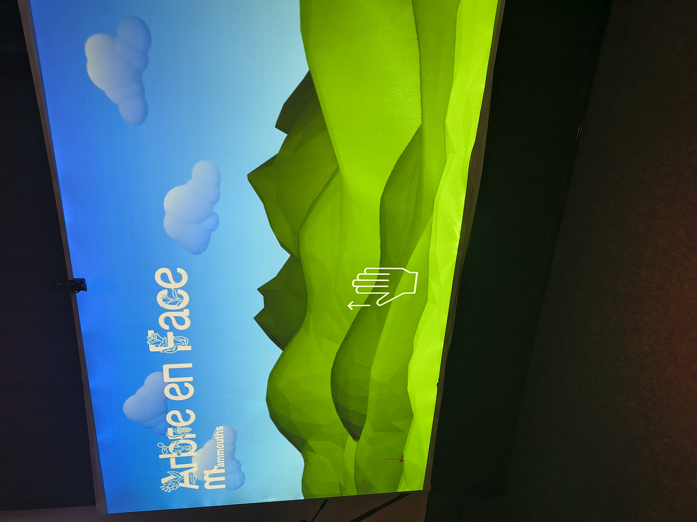
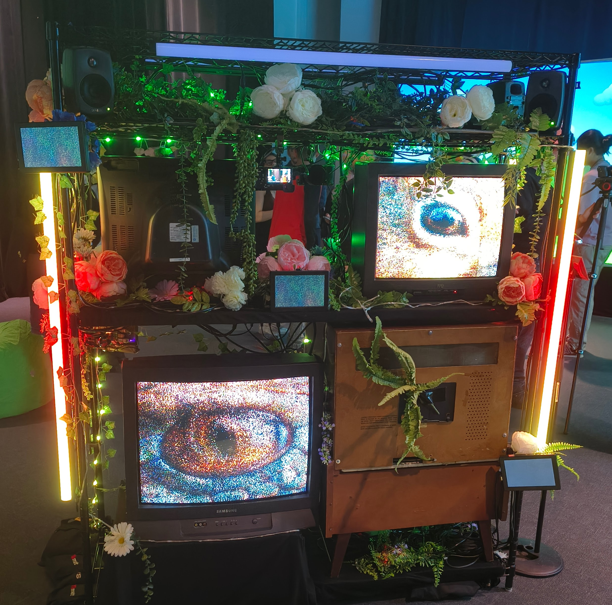
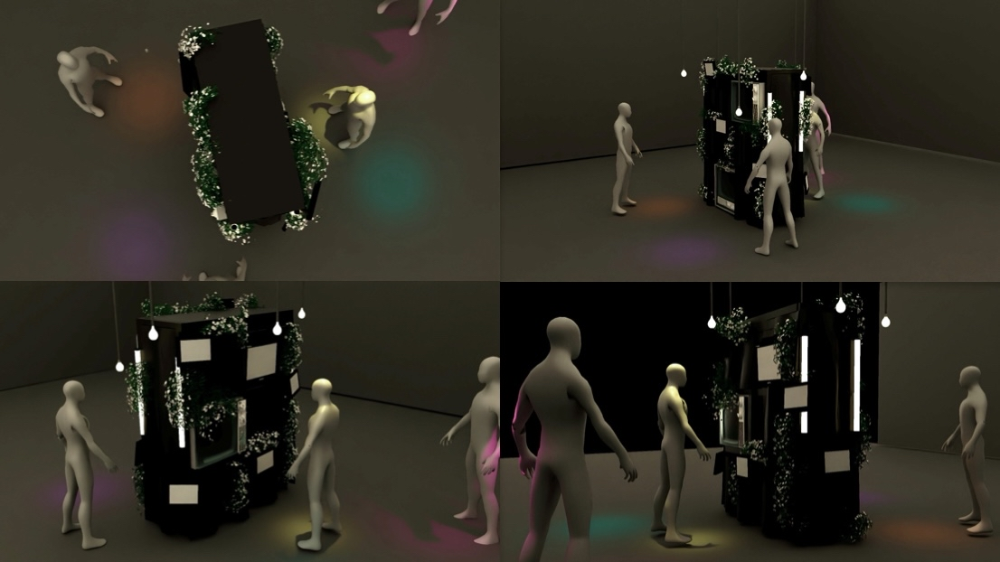
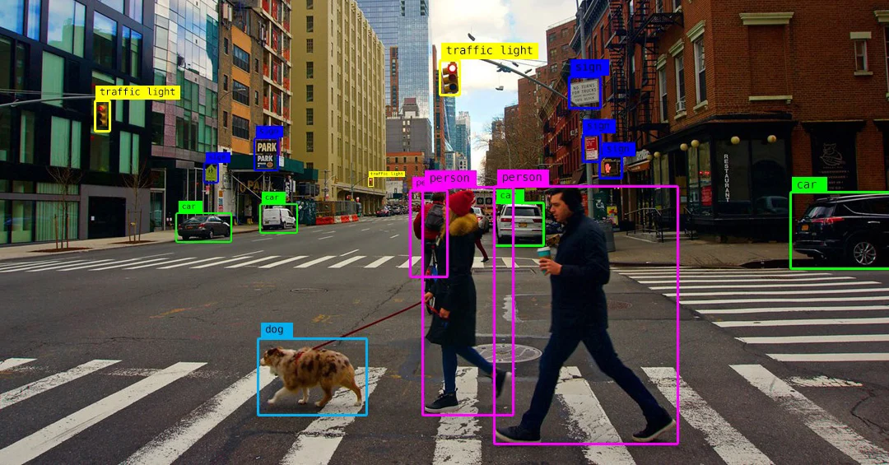
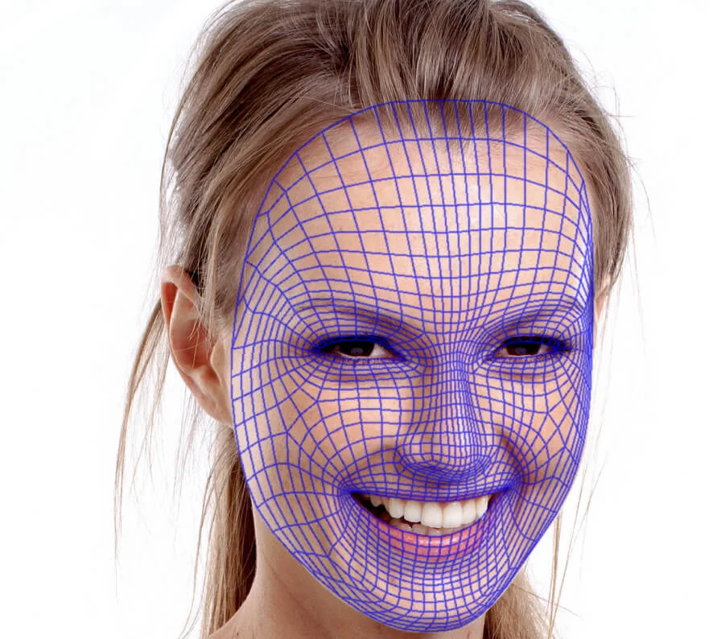

### Pour les autres projets de l'exposition, voici l'ordre de mes préférences : #2- O.I.G.N.O.N. , #3- Symbiose , #4- Océan rouge , #5- Arbre en Face et le #6- Quand les Yeux Se croisent.

---

## #2- O.I.G.N.O.N.

Voici le nom de tous les créateurs du projet : *Ahmed Kaissoumi* , *Radhouane Kordan* , *Justin Montpetit* , *Thearylou Lach* et *Jad Saloumi*. [Équipe de production](https://o-i-g-n-o-n.github.io/Mission-decollage/#/equipe/)

 
> L'image de gauche est la vue d'ensemble du projet OIGNON
Ce que je ressens :
Avant de l'essayer, j’avais déjà le sentiment que ce projet pouvait être très intéressant, notamment par son univers visuel. Après l’avoir expérimenté, ma première impression s’est confirmée : c’est un très bon projet. J'ai trouvé que l'interaction était bien ficelée et que l'expérience globale était solide, ce qui justifie sa position juste après mon projet coup de cœur.

---

## #3- Symbiose

Voici le nom de tous les créateurs du projet : *Yannick Chamberland* , *Benjamin Ferland* , *Ryan Dufault* et *Walid Cheour*. [Équipe de production](https://les-chimistes.github.io/symbiose/#/equipe/)

 

Ce que je ressens :
Mon avis initial était semblable à celui d'O.I.G.N.O.N., bien que j'étais un peu moins certain du résultat final. Une fois l'expérimentation terminée, je considère que c’est un projet assez bon et réussi. Cependant, je l'ai placé en troisième position car j'ai trouvé qu'il faisait preuve d'un peu trop de simplicité dans son exécution ou sa mécanique par rapport au projet précédent.

---

## #4- Océan rouge

Voici le nom de tous les créateurs du projet : *Amira Tounekti* et *Kristy Moussally*. [Équipe de production](https://deux-intelligence.github.io/deux-neurones/#/equipe/)

 

Ce que je ressens :
Avant de tester l'installation, je me disais que le concept avait du potentiel, mais sans avoir d'attentes particulièrement élevées. Après avoir vécu l'expérience, mon impression est restée mitigée : j'ai trouvé le projet un peu trop « basic ». Bien que l'idée de départ soit là, il m'a manqué un élément plus complexe ou plus percutant pour m'accrocher davantage.

---

## #5- Arbre en Face

Voici le nom de tous les créateurs du projet : *Alexandre Gendron* , *Mikael Arseneau* , *Mathieu Willett* , *Matis Ghariani* et *Rafael Angon Dubé*. [Équipe de production](https://mammouths.github.io/projet/#/equipe/)

 

Ce que je ressens :
J'avais une vision plutôt positive avant l'expérimentation, pensant que ce serait un bon projet. Toutefois, après l'avoir essayé, j'ai trouvé le dispositif beaucoup trop simple à mon goût. Je reconnais que pour certains, cela peut représenter un dispositif multimédia vraiment « cool » ou relaxant à explorer, mais personnellement, je n'ai pas été convaincu par l'interaction proposée.

---

## #6- Quand les Yeux Se croisent

Voici le nom de tous les créateurs du projet : *Edelwyn Ledru* , *Félix Lavoie* , *Jade Hébert* , *Manel Yaya* et *Patricia Nassif*. [Équipe de production](https://emersiaa.github.io/Quand-les-yeux-se-croisent/#/equipe/)

 

Ce que je ressens :
J'étais très sceptique face à ce projet avant même de l'essayer. Malheureusement, l'expérimentation n'a pas réussi à lever mes doutes. J'ai trouvé qu'il manquait un élément déclencheur ou une mécanique qui accroche réellement l'interacteur. C’est pour cette raison que je l'ai placé en dernière position de mes préférences, car je n'ai pas ressenti l'intérêt ou l'immersion que je recherchais.

---

Pour avoir les compétences pour créer ce genre de projet voici 3 cours du programme qui me semblent incontournables : *Traitement audiovisuel* , *Animation 3D* et *Web 5*.

#### Technique ou composante technologique méconnue
Nom de la technique : La Vision par ordinateur (Computer Vision) et le Suivi facial (Face Tracking).

Description :
Dans le projet *Quand les Yeux Se croisent*, j'ai découvert l'utilisation de la vision par ordinateur. Cette technique permet à un ordinateur de "voir" et d'analyser les images provenant d'une caméra en temps réel. Grâce à des algorithmes de suivi facial, le système est capable de repérer précisément la position des yeux de l'interacteur dans l'espace. Concrètement, l'installation utilise ces données pour isoler le regard de la personne et le projeter instantanément sur les télévisions, tout en adaptant la taille et la direction des yeux selon que l'on se déplace ou que l'on s'approche. Avant l'exposition, je savais qu'une caméra pouvait filmer, mais je ne connaissais pas la complexité technique nécessaire pour que le logiciel "comprenne" les mouvements du visage et les traduise en interactions visuelles et lumineuses (LED) de manière aussi fluide.

 
> L'image de gauche (computer vision) a été pris sur le site algotive.ai et l'image de droite (face tracking) a été pris sur le site banuba.com
