# Documentation - Visite d'exposition finissants TIM, grand studio

## Exposition

**Titre :** Réseau Vivant  
**Lieu :** Collège Montmorency, grand studio  
**Type :** Exposition temporaire, intérieure  
**Date de ma visite :** Mardi 24 Février 2026 et Mardi 17 Mars 2026

L’exposition *Réseau Vivant* s’intéresse à la notion de connectivité et aux expériences que nous partageons, en se présentant comme une toile en constante évolution faite d’échanges, de gestes, de données et d’émotions. Cette idée est au cœur de l’exposition collective des finissantes et finissants en Techniques d’intégration multimédia du Collège Montmorency, qui y dévoilent le résultat de leur parcours commun en mettant de l’avant les compétences acquises ainsi que les liens créés tout au long de leur formation. Par sa présence et ses interactions, le public participe activement à la transformation du réseau et des œuvres présentées.

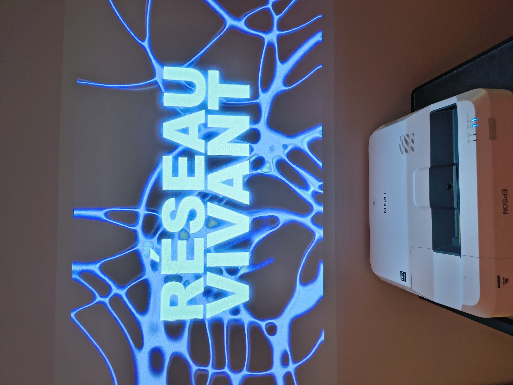 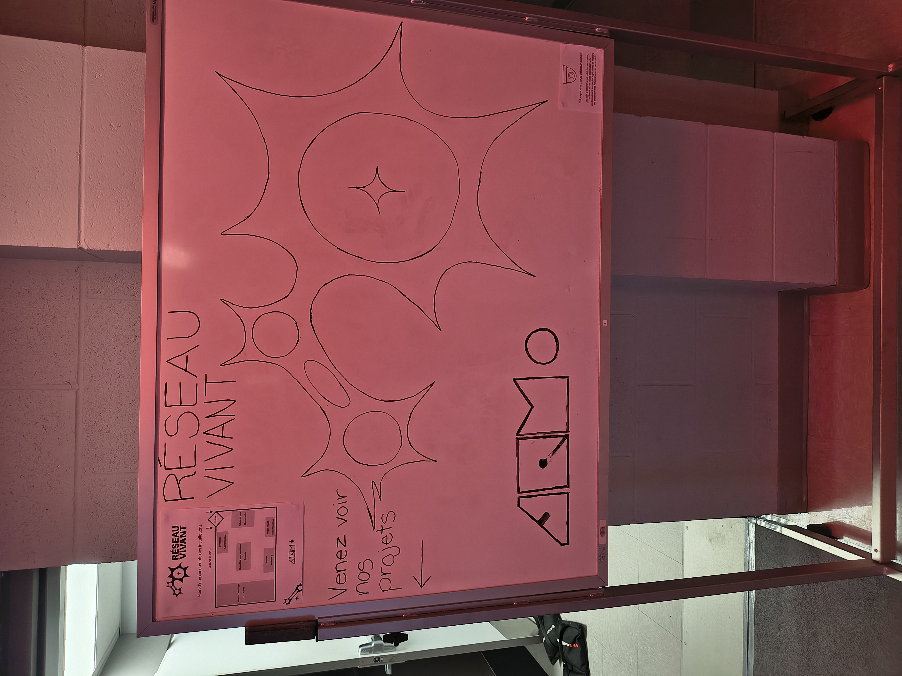

---

# Projet choisi

## Terminal

**Équipe de production :** Émeryk Bélisle, Elie Daher, Ting Yung Lu Terry, Dana Saavedra-Torrano et Mégane Ranger

**Année de réalisation :** 2026

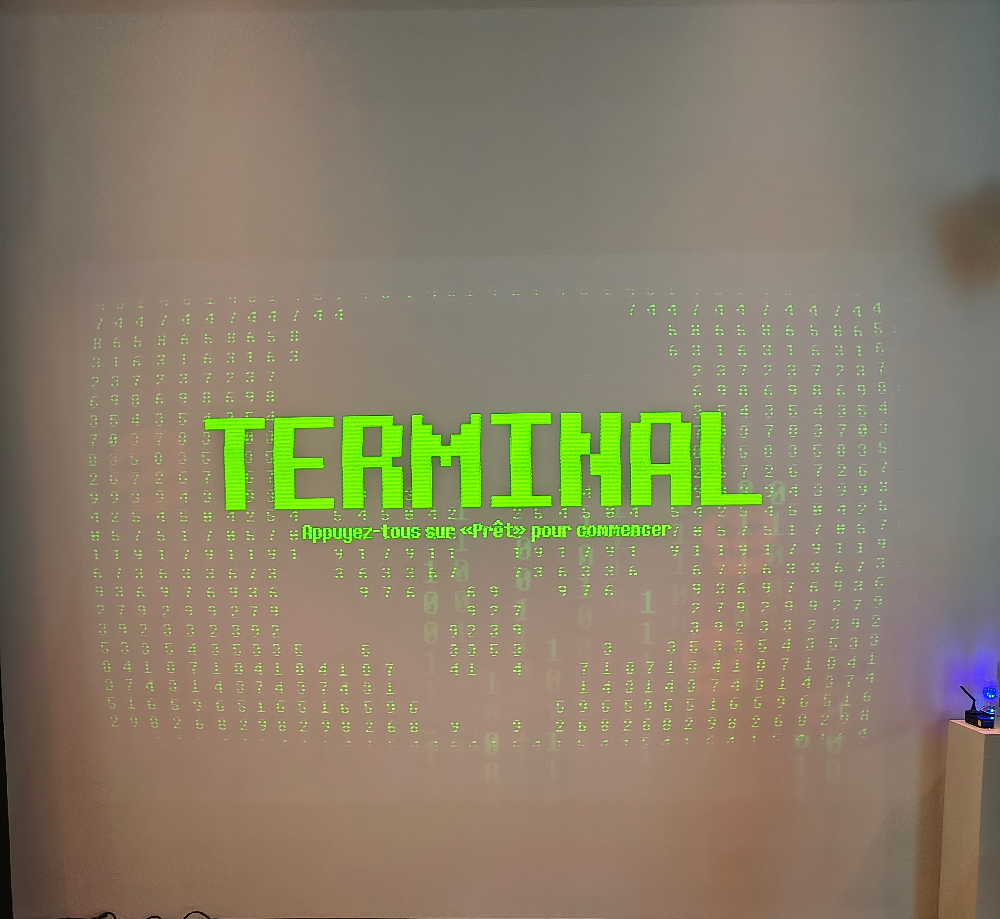 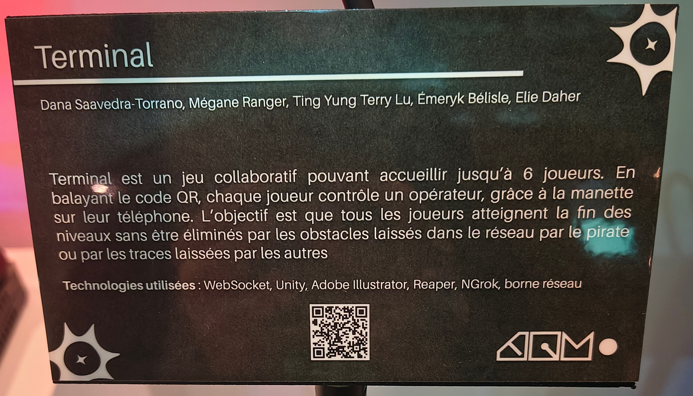

---

## Description de l’oeuvre

*TERMINAL* se présente comme une expérience vidéoludique coopérative pour un maximum de six joueurs. L'intrigue plonge les participants dans une mission de sauvetage de données corrompues par un pirate informatique. La mécanique principale repose sur la gestion de l'espace : chaque mouvement génère une traînée persistante qui agit comme un obstacle mortel pour les autres, forçant une coordination constante pour atteindre la sortie sans encombre.

---

## Type d’installation

Le projet se définit comme une installation interactive, immersive et temporaire, mise en place spécifiquement pour l'exposition Réseau Vivant. L'interactivité est au cœur du concept, puisque le public utilise ses propres téléphones intelligents comme manettes de jeu. L'aspect immersif est quant à lui assuré par la combinaison d'une projection murale grand format, d'un environnement sonore directionnel et d'un éclairage qui permet une ambience directe avec le jeu et avec celui des joueurs dans le studio.

---

## Fonction du dispositif multimédia

Le système remplit plusieurs fonctions stratégiques qui dépassent le simple cadre du divertissement. En tant que support pédagogique et expérientiel, il favorise l'apprentissage de la collaboration par l'essai et l'erreur, poussant les participants à communiquer verbalement pour progresser. Le dispositif a également pour fonction de mettre en valeur l'interaction sociale en transformant un groupe de visiteurs en une équipe soudée partageant une responsabilité commune. Enfin, il assure une fonction scénographique en utilisant des composantes physiques comme des LEDs pour créer un pont visuel entre le monde virtuel et l'espace réel.

---

## Mise en espace

L'organisation physique du grand studio a été optimisée pour favoriser le regroupement des joueurs face à la projection murale. Des poufs colorés, verts et oranges, sont disposés au sol pour offrir une assise confortable et délimiter l'aire de jeu. L'entrée de la zone est structurée par deux socles distincts : l'un accueille le cartel descriptif présentant le projet, tandis que l'autre supporte l'infrastructure technique incluant le routeur et un cube de LEDs réactives. L'ambiance visuelle est dominée par la projection du titre "TERMINAL", intégrant un effet de code numérique défilant qui invite les participants à se connecter.

---

## Composantes et techniques

La réalisation technique du projet repose sur l'intégration de plusieurs outils et matériels :

- Logiciels de création : Utilisation d'Unity pour le moteur de jeu, pour le langage et l'environnement, et pour la projection ainsi que de Reaper pour la conception sonore.

- Infrastructure réseau : Communication en temps réel assurée par le protocole WebSocket, le système NGrok et une borne réseau (routeur) dédiée.

- Diffusion visuelle : Projecteurs installés au plafond pour la projection murale principale.

- Diffusion sonore : Haut-parleurs de monitoring Focal suspendu au plafond pour une immersion audio précise.

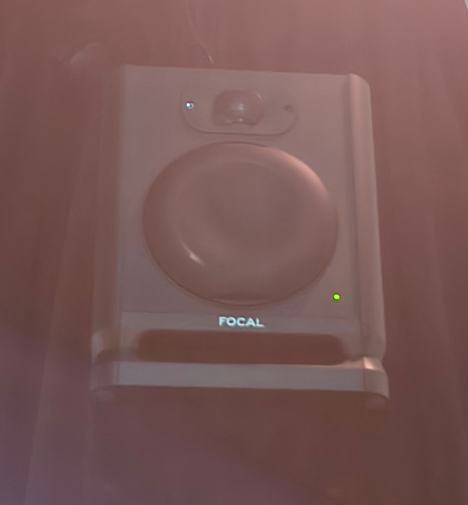 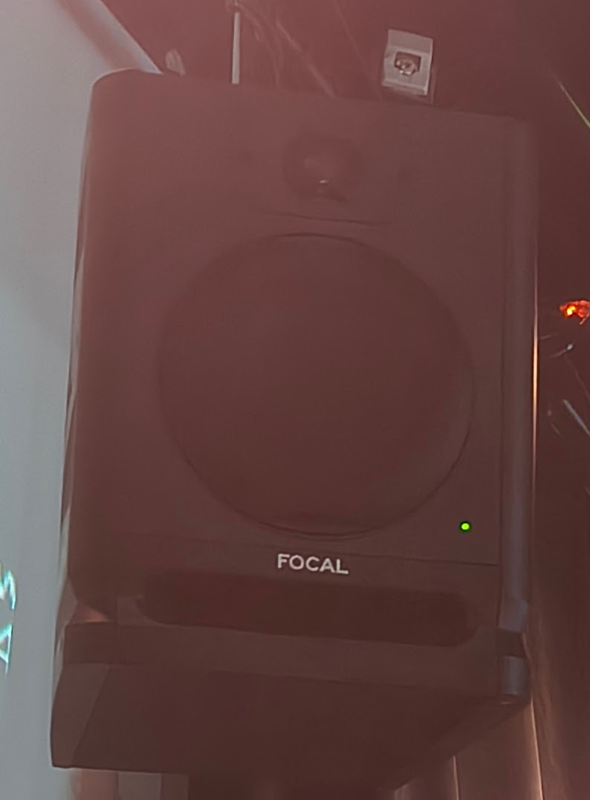 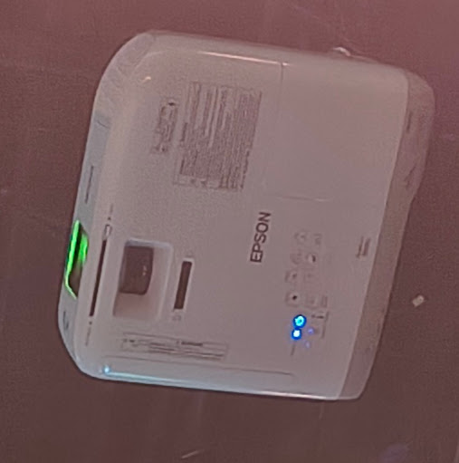 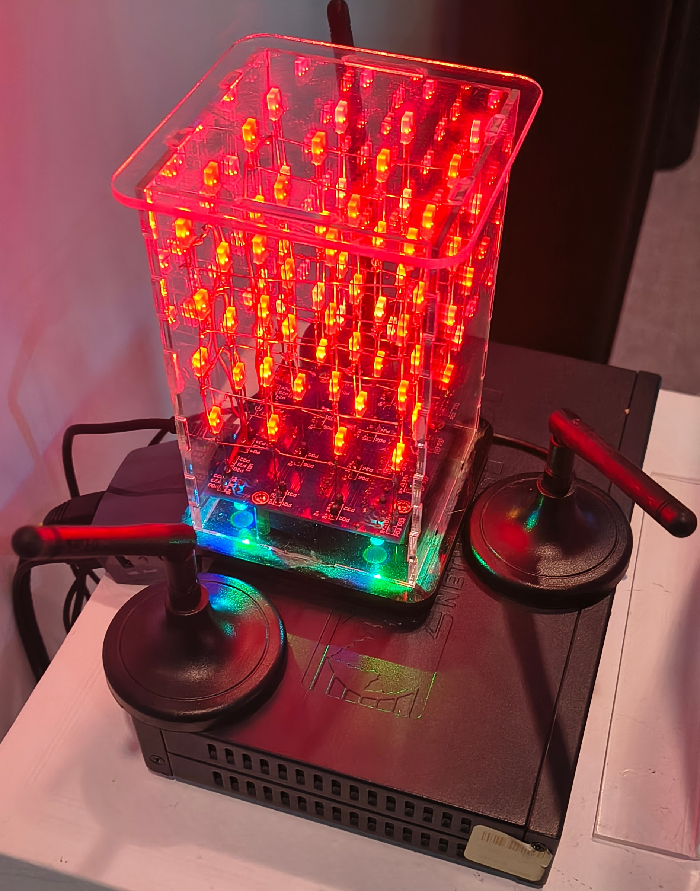

---

## Éléments nécessaires à la mise en exposition

Pour assurer le bon fonctionnement et l'accessibilité du projet dans l'espace d'exposition, les éléments suivants sont requis :

- Mobilier de support : Deux socles pour accueillir le matériel informatique et les cartels d'information.

- Confort des visiteurs : Poufs ergonomiques colorés pour délimiter la zone de jeu et permettre aux interacteurs de s'installer.

- Infrastructure invisible : Système complet de câblage et fils électriques pour l'alimentation des équipements et la transmission de données entre les différents modules.

- Signalétique interactive : Affiches avec codes QR pour permettre la connexion instantanée des téléphones LTE ou locaux.

- Éléments d'ambiance physique : Cube LED et bâtons lumineux synchronisés pour le retour visuel en temps réel dans la salle.

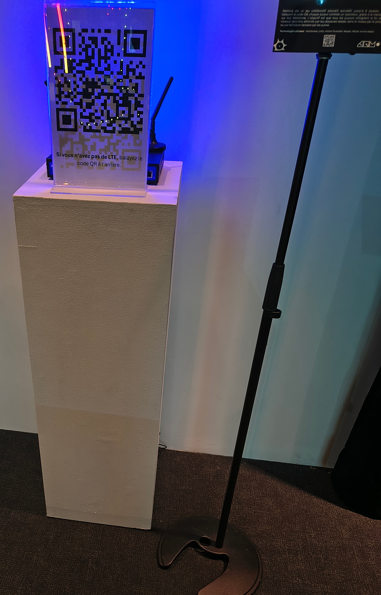 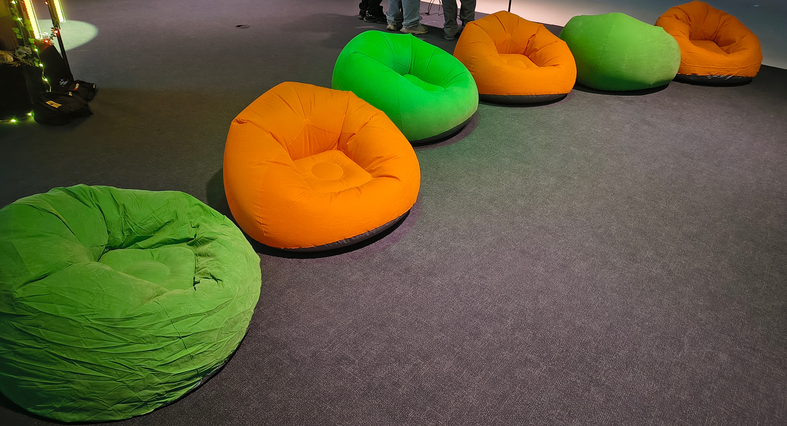 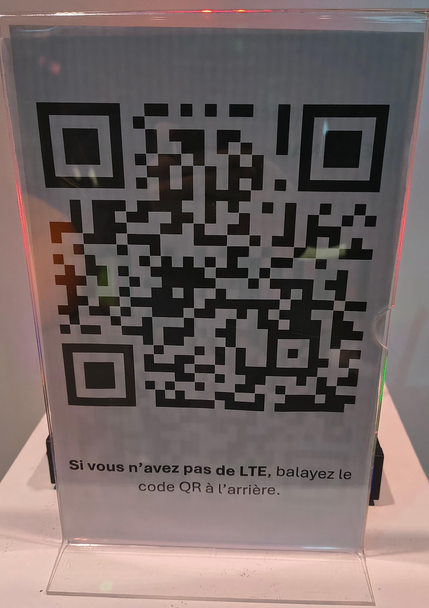

---

## Expérience vécue

J'ai particulièrement apprécié le fait de jouer à un jeu vidéo dont l'approche diffère totalement de ce à quoi je suis habitué. Le parcours m'a semblé fluide : du scan du code QR jusqu'à l'entrée dans le niveau, j'ai senti que mon rôle d'opérateur était central. Contrairement aux jeux classiques, j'ai dû ici constamment négocier mes déplacements avec mes alliés pour ne pas les piéger.

---

## Ce qui m’a plu

Ce qui m'a le plus séduit, c'est le contrôle direct de mon personnage via mon téléphone et la perception immédiate de mes actions sur la projection murale. Cette synchronisation en temps réel m'a donné un sentiment de puissance et d'impact direct sur l'œuvre. L'utilisation d'un objet personnel comme interface a rendu l'expérience très intuitive pour moi.

---

## Ce que je ferais autrement

Si je devais revoir un aspect du projet, je travaillerais sur l'équilibrage de la difficulté de certains niveaux. Lors de ma partie, j'ai remarqué que certains passages étaient extrêmement complexes, au point de créer une certaine frustration car nous n'arrivions pas à les franchir. Je simplifierais ces niveaux pour assurer une progression plus fluide et gratifiante pour tous les types de joueurs.

---

## Références

Photos : Vincent Quesnel  
Exposition : Collège Montmorency, grand studio  
Équipe de production : Émeryk Bélisle, Elie Daher, Ting Yung Lu Terry, Dana Saavedra-Torrano et Mégane Ranger  
Oeuvre : Terminal

Liens consultés : [Github terminal](https://pythons-5.github.io/Terminal/#/) [Présentation exposition Réseau Vivant](https://tim-montmorency.com/2026/)
