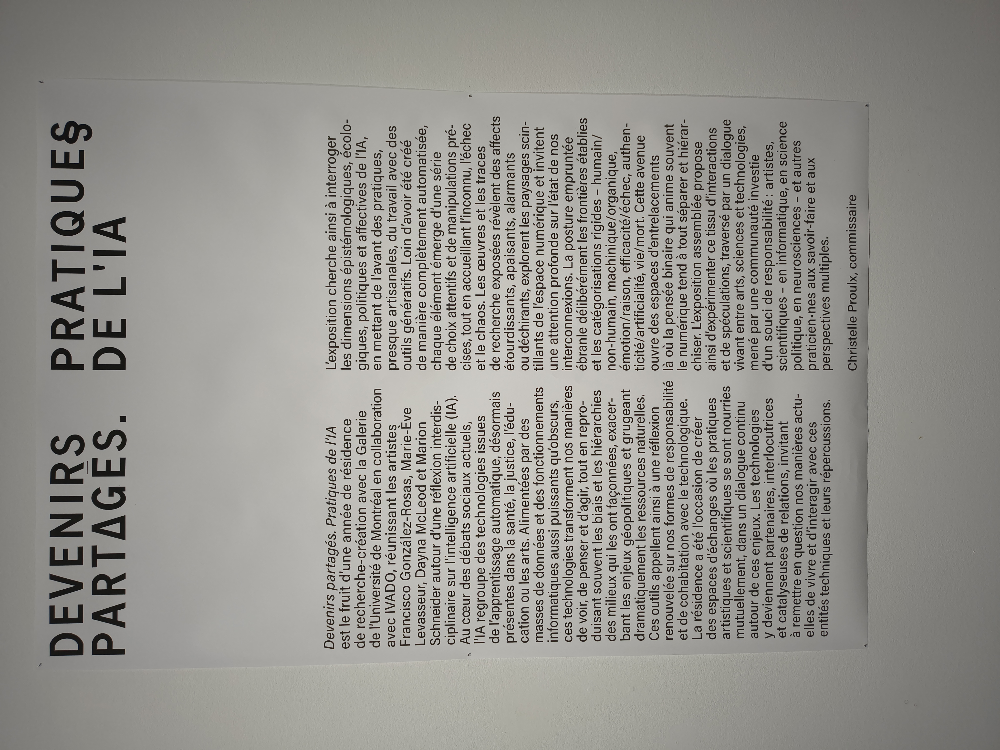
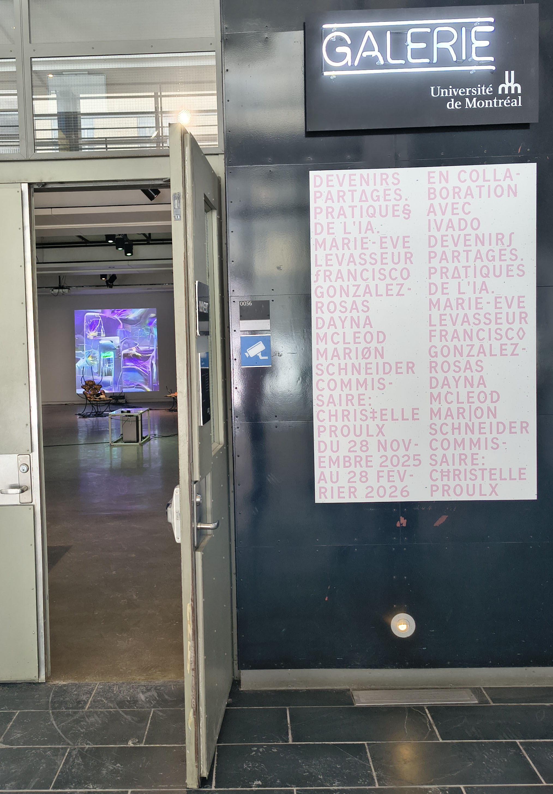
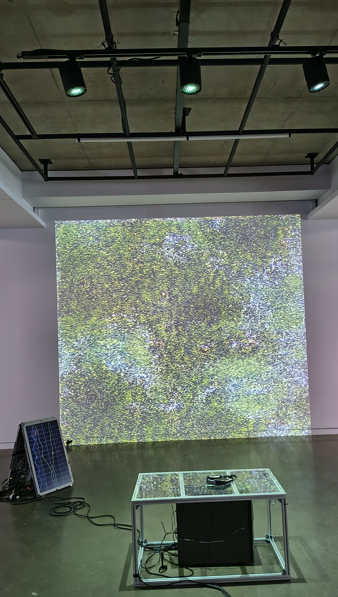
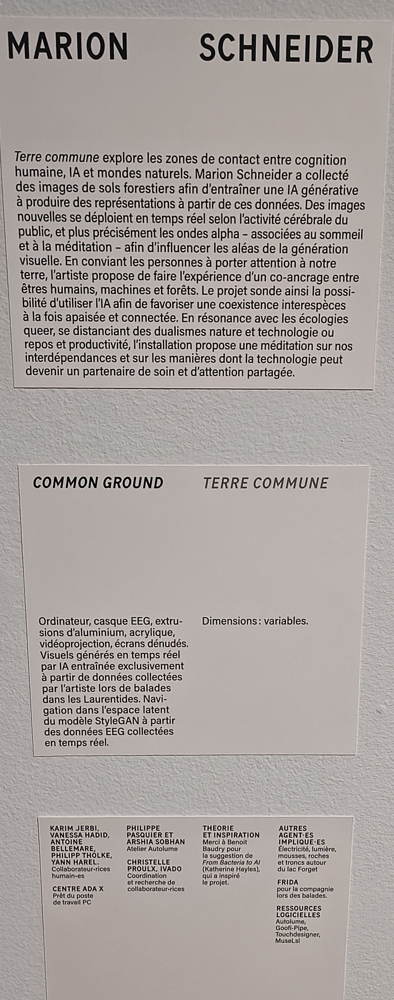
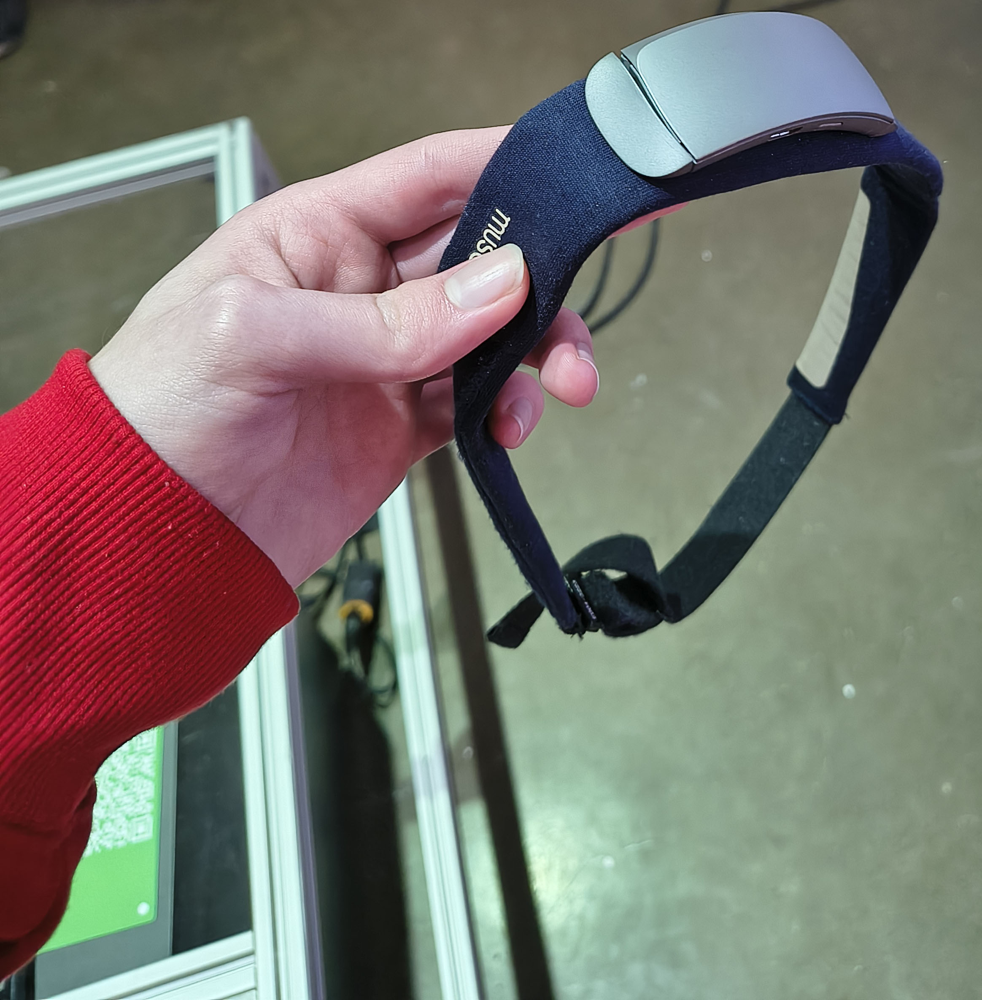
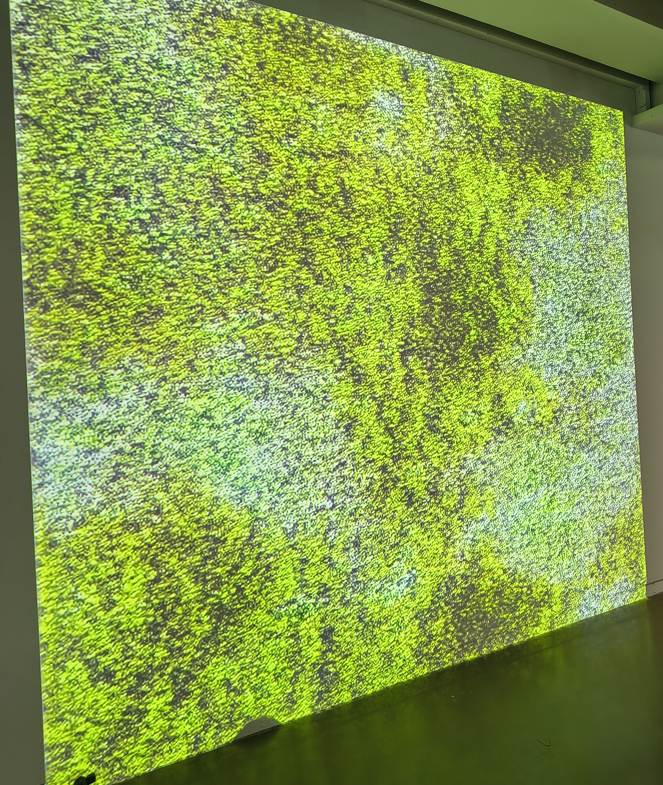
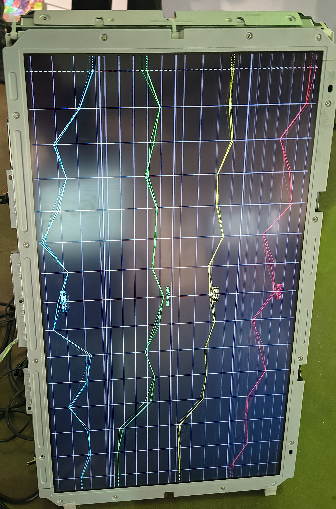
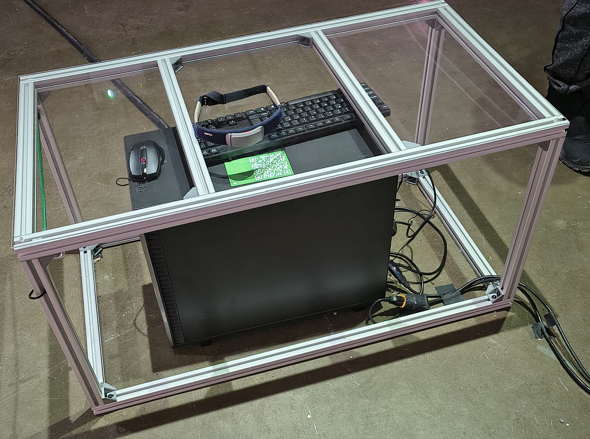
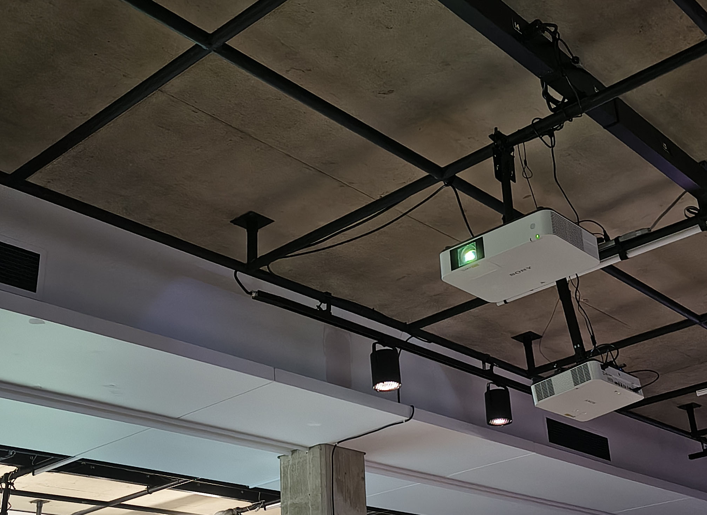
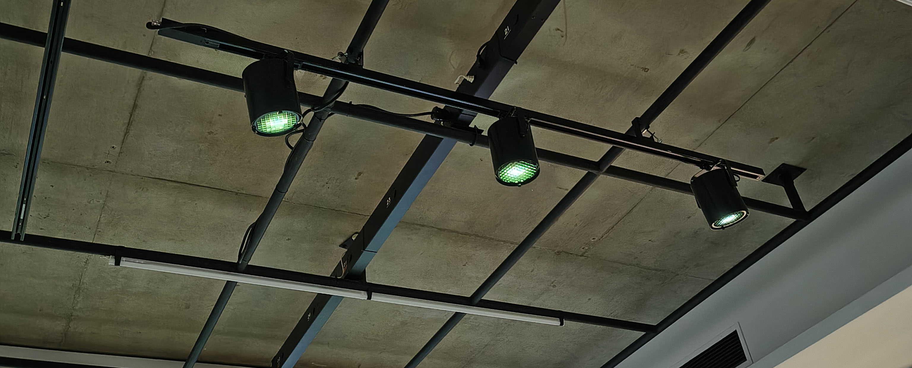

# Documentation – Visite d’exposition

## Exposition

**Titre :** Devenirs partagés. Pratiques de l’IA  
**Lieu :** Université de Montréal  
**Type :** Exposition temporaire, intérieure  
**Date de ma visite :** 30 Janvier 2026

L’exposition *Devenirs partagés. Pratiques de l’IA* explore les liens entre l’intelligence artificielle, la création artistique et le vivant. Les oeuvres présentées interrogent notre rapport aux technologies et la manière dont elles influencent notre perception, nos émotions et notre compréhension du monde.

---

# Oeuvre choisie

## Terre commune  
**Artiste :** Marion Schneider

---

## Description de l’oeuvre

*Terre commune* est une installation immersive qui propose une expérience sensorielle liée à l’activité cérébrale. Pour participer, le visiteur doit porter un bandeau et se placer devant un écran diffusant des images générées numériquement. Ces images sont conçues pour favoriser un état de calme et influencer les ondes cérébrales.

À côté de l’écran principal, un second écran plus petit affiche une visualisation animée représentant les ondes cérébrales. Cette représentation rend visible une activité normalement invisible, créant un lien entre l’expérience intérieure du participant et sa traduction visuelle à l’écran.

---

## Type d’installation

L’installation est immersive, car elle engage directement la perception du visiteur. Le port du bandeau limite les distractions et augmente la concentration sur les images projetées.  

Elle comporte également une dimension interactive, puisque l’expérience dépend de la participation active du visiteur et de son état mental. Chaque personne peut vivre l’œuvre de manière différente.

(**Pour la vue d'ensemble, réferez-vous à l'image dans Oeuvre choisie**)

---

## Fonction du dispositif multimédia

Le dispositif multimédia sert à rendre visibles les ondes cérébrales et à établir un lien entre le cerveau humain et les systèmes technologiques.  

En combinant  les images générées et la visualisation de données cérébrales, l’artiste propose une réflexion sur la relation entre l’humain et la machine. L’oeuvre questionne la manière dont la technologie peut influencer ou représenter notre activité mentale.

---

## Mise en espace

L’installation est disposée de manière à créer une expérience intime. L’écran principal capte toute l’attention du participant, tandis que le petit écran secondaire agit comme une preuve visuelle de l’activité cérébrale.

L’espace est organisé pour favoriser la concentration et donner l’impression d’être dans un environnement expérimental ou méditatif.

(**Pour le croquis, réferez-vous à l'image dans Oeuvre choisie**)

---

## Composantes et techniques

L’oeuvre comprend :

- Un écran principal diffusant des images générées numériquement  
- Un écran secondaire montrant la visualisation des ondes cérébrales  
- Un bandeau porté par le visiteur  
- Un système informatique    

La partie technique repose sur la transformation de données liées à l’activité cérébrale en formes visuelles animées.

---

## Éléments nécessaires à la mise en exposition

Pour que l’installation fonctionne correctement dans l'espace d’exposition, plusieurs éléments sont nécessaires :

- Un espace suffisamment calme pour favoriser la concentration  
- Un éclairage contrôlé ou tamisé pour améliorer la visibilité des écrans  
- Une surface murale ou un support stable pour installer les écrans  
- Une prise électrique et une alimentation continue pour le système informatique  
- Un support ou meuble pour le petit écran secondaire  
- Un espace dégagé permettant au visiteur de se placer confortablement devant l’installation   

Ces éléments sont essentiels pour préserver le caractère immersif de l’oeuvre et assurer son bon fonctionnement technique.

---

## Expérience vécue

Lorsque j’ai participé à l’installation, j’ai immédiatement ressenti une forme d’isolement due au bandeau. Cela m’a obligé à me concentrer uniquement sur les images projetées.  

Les images donnaient une impression de calme et de ralentissement. Ensuite, voir les ondes cérébrales animées sur le petit écran m’a permis de faire un lien entre ce que je ressentais et une représentation visuelle de mon activité mentale.

Même si je ne pouvais pas vérifier scientifiquement l’impact réel sur mon cerveau, l’expérience fonctionnait sur le plan psychologique et m’a amené à réfléchir au rôle de la technologie dans notre perception.

---

## Ce qui m’a plu

J’ai particulièrement apprécié le lien entre l'art et les neurosciences. Le concept est simple, mais efficace.  

Le fait de rendre visible les ondes cérébrales rend l’installation plus concrète et engageante. L’aspect immersif rend l’expérience personnelle et marquante.

---

## Ce que je ferais autrement

Si je devais améliorer l’installation, j’ajouterais davantage d’explications sur le fonctionnement scientifique du dispositif.  

Je proposerais aussi un système de rétroaction plus clair en temps réel pour mieux percevoir l’impact de l’expérience sur l’activité cérébrale.

---

## Références

Photos : Vincent Quesnel  
Exposition : Université de Montréal  
Artiste : Marion Schneider  
Oeuvre : *Terre commune*
