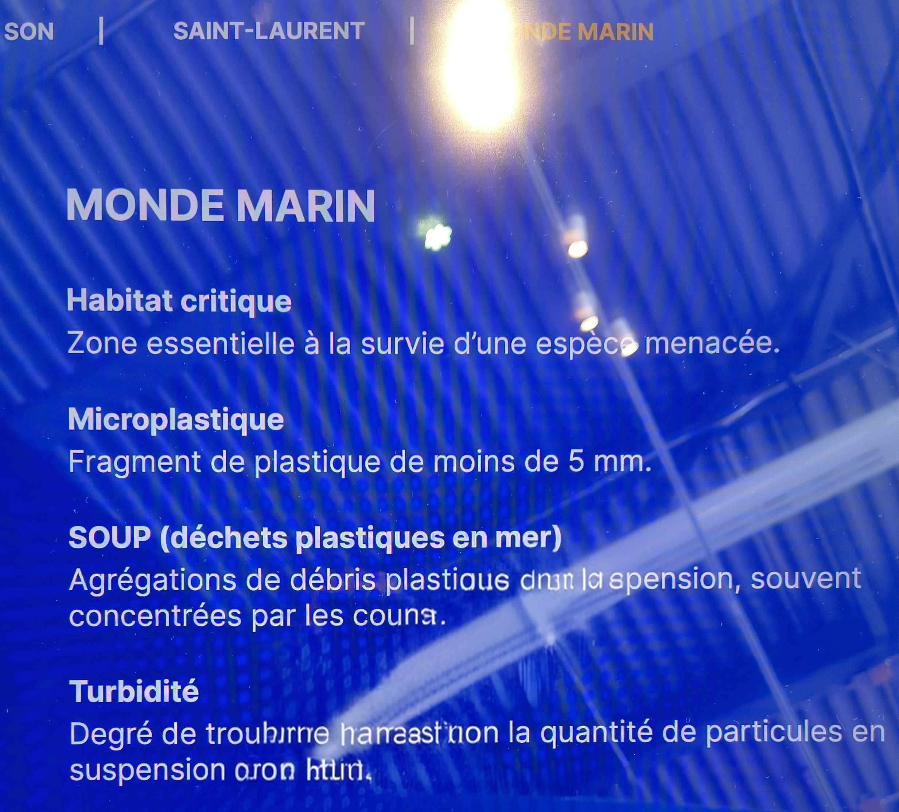

# Documentation - Visite d'exposition individuelle

## Exposition

**Titre :** Eaux vives — Présentée par Panorama Expérience.
**Lieu :** Grand Quai du Port de Montréal.
**Type d'exposition :** Intérieure et immersive.
**Date de ma visite :** Mardi 3 Mars 2026.

L'exposition *Eaux vives* est le premier parcours thématique présenté par *Panorama Expérience*, un nouvel espace immersif permanent situé au **Grand Quai du Port de Montréal**. Situé stratégiquement au-dessus du fleuve Saint-Laurent, ce lieu sert de laboratoire de récits où la technologie rencontre la science et la nature.

 
> La photo de gauche est la description de l'exposition et la photo de droite est l'endroit où l'exposition a eu lieu. Les photos ont été prises par moi (Vincent Quesnel)
---

# Oeuvre choisie

## Échos de l'esprit de la Baleine 

Artiste : Marshmallow Laser Feast (MLF). 

Année de réalisation : 2024.

 
> La photo de gauche est la vue de l'ensemble de l'oeuvre et la photo de droite est la description de l'oeuvre. Les photos ont été prises par moi (Vincent Quesnel)
---

## Description de l'œuvre

*Échos de l'esprit de la baleine* est une installation contemplative monumentale. Voici comment le cartel numérique décrit le concept :
> « Une plongée sonore et visuelle au cœur de l'univers des cétacés, où le son devient une sensation physique. »
> — *Source : Cartel numérique de l'exposition*

Le dispositif se compose de trois écrans géants de 30 pieds de large entourant l'espace de diffusion. Le spectateur est placé au centre, face à une projection à 360° qui montre les mouvements des baleines en vue sous-marine. L'originalité réside dans la synchronisation du visuel avec un système de vibration tactile intégré au mobilier.

---

## Type d'installation

L'installation est immersive mais également contemplative, car Les sorties vidéo et audio multi-canaux qui en résultent sont rendues en une installation immersive, nous permettant d’entrevoir ce que cela peut faire de « voir » à travers le son, comme le font les baleines.

(**Pour la vue d'ensemble, réferez-vous à l'image dans Oeuvre choisie**)

---

## Fonction du dispositif multimédia

D'après mon analyse, ce dispositif remplit une fonction poétique, sensorielle et didactique. L'objectif premier est de briser la barrière entre le spectateur et le monde marin en rendant le chant des baleines tangible. Ce n'est pas seulement une vidéo que l'on regarde ; c'est un environnement que l'on "ressent" par la peau grâce à la conduction osseuse et aux vibrations du mobilier. Sur le plan pédagogique, le système utilise la technologie pour illustrer des concepts invisibles : la puissance des ondes acoustiques sous l'eau. En synchronisant les caissons de basses fréquences avec les fréquences réelles des cétacés, le dispositif permet de comprendre l'ampleur physique de leur communication. Enfin, j'ai remarqué une fonction scénographique essentielle : le dispositif agit comme un cocon protecteur qui force le ralentissement du rythme cardiaque et de la respiration, mettant le visiteur dans un état de réceptivité maximale pour absorber le message de sensibilisation environnementale porté par Panorama.

---

## Mise en espace

L'organisation spatiale est le résultat d'une ingénierie rigoureuse visant à isoler totalement le visiteur du monde extérieur. L'expérience est conçue comme un parcours de décompression : elle débute par un couloir de transition sombre qui permet à l'œil de s'adapter à la pénombre et à l'esprit de se détacher des stimuli du reste du bâtiment. Une fois à l'intérieur de la salle, on découvre une configuration en "arène contemplative". Le centre de cet espace est occupé par le banc massif vibrant, positionné stratégiquement au "sweet spot" acoustique (le point où les 6 haut-parleurs convergent parfaitement). Les poufs, disposés de manière plus aléatoire autour du banc, offrent des points de vue variés mais conservent cette proximité avec le sol, renforçant le sentiment d'humilité face aux projections monumentales. Le cloisonnement est assuré par d'épais rideaux de fond noirs qui ne se contentent pas de bloquer la lumière : ils piègent les ondes sonores pour éviter toute réverbération parasite, garantissant que les sons des baleines restent nets. L'éclairage, dominé par des faisceaux de couleur bleue, baigne l'espace dans une atmosphère de "pression lumineuse" qui rappelle les profondeurs de l'océan, complétant ainsi l'immersion physique par une immersion chromatique totale.

 
> La photo de gauche représente le croquis de l'oeuvre et la photo de droite représente le plan de tout les espaces de l'exposition. Les photos ont été prises par moi (Vincent Quesnel)
---

## Composantes et techniques
En observant attentivement l'installation et son fonctionnement, j'ai identifié les éléments suivants :
* **Visuel :** Trois projecteurs haute définition diffusant sur des écrans de 30 pieds.
* **Audio spatialisé :** Un système composé de **6 haut-parleurs** permettant au son de voyager tout autour du spectateur.
* **Banc vibrant :** La composante technique majeure. Le banc contient des **caissons de basses fréquences (subwoofers)** dissimulés à l'intérieur. Un poteau central assure la gestion du câblage vers le plafond.

    
> Les photos suivantes représentes tout les composants nécessaires à l'oeuvre. Les photos ont été prises par moi (Vincent Quesnel)
---

## Éléments nécessaires à la mise en exposition

Pour que cette installation fonctionne, plusieurs éléments de structure sont essentiels :
* **Isolation acoustique :** D'épais **rideaux de fond noirs** couvrent les murs pour absorber l'écho et isoler la salle des bruits extérieurs.
* **Éclairage d'ambiance :** Un système d'éclairage de **couleur bleue** participant à l'immersion sous-marine.
* **Mobilier technique :** Le banc vibrant conçu sur mesure et des poufs pour le confort.
* **Sécurité :** Une gestion invisible des câbles sous le plancher ou via le poteau central pour éviter les chutes dans le noir.

    
> Les photos suivantes représentes tout les éléments nécessaires à la mise en exposition de l'oeuvre. Les photos ont été prises par moi (Vincent Quesnel)
---

## Expérience vécue

Le parcours commence par une immersion progressive dans le noir. En tant que spectateur, le geste principal est de choisir son emplacement (banc ou pouf). Une fois assis sur le banc, on adopte une posture de contemplation. Pendant environ 15 minutes, on ressent les vibrations monter dans le corps lors des chants graves, ce qui transforme une écoute passive en une expérience physique intense.

---

## Ce qui m'a plu

Ce qui m'a le plus séduit, c'est l'intégration du son dans le mobilier. Voir la baleine à l'écran tout en "sentant" son chant vibrer dans le banc rend l'expérience extrêmement crédible et mémorable. C'est une excellente utilisation de la technologie pour toucher les sens.

  
> Les photos suivantes représentes les différents panneaux d'information sur le thème de l'exposition. Les photos ont été prises par moi (Vincent Quesnel)
---

## Ce que je ferais autrement
Si je devais suggérer des améliorations :
* **Signalétique :** J'ajouterais une indication expliquant que le banc est un élément technologique vibrant, car certains visiteurs pourraient ne pas oser s'y asseoir ou rater cette sensation.
* **Accessibilité :** J'ajouterais de faibles repères lumineux au sol (LED bleues) pour guider les gens vers le mobilier central, car l'obscurité est très dense.

---

## Références
Photos : Vincent Quesnel
Exposition : Grand Quai du Port de Montréal
Artiste : Marshmallow Laser Feast.
Oeuvre : *Échos de l'esprit de la Baleine*
Liens consultés : [site créateur](https://marshmallowlaserfeast.com/project/seeing-echoes-in-the-mind-of-the-whale/)
[info exposition](https://feverup.com/m/517639?cp_landing_source=infinity-experiences&utm_source=newsletter&utm_medium=email&utm_campaign=batir_phi_contemporain_episode_1_l_idee&utm_term=2026-02-09)
[info oeuvre](https://infinity-experiences.com/uploads/PDF-Uploads/Panorama_EauxVives_CartelsNumeriqeus_MLF.pdf)
