# Documentation - Visite d'exposition individuelle

## Exposition

**Titre :** Eaux vives — Présentée par Panorama Expérience.
**Lieu :** Grand Quai du Port de Montréal.
**Type d'exposition :** Intérieure et immersive.
**Date de ma visite :** Mardi 3 Mars 2026.

L'exposition *Eaux vives* est le premier parcours thématique présenté par *Panorama Expérience*, un nouvel espace immersif permanent situé au **Grand Quai du Port de Montréal**. Situé stratégiquement au-dessus du fleuve Saint-Laurent, ce lieu sert de laboratoire de récits où la technologie rencontre la science et la nature.

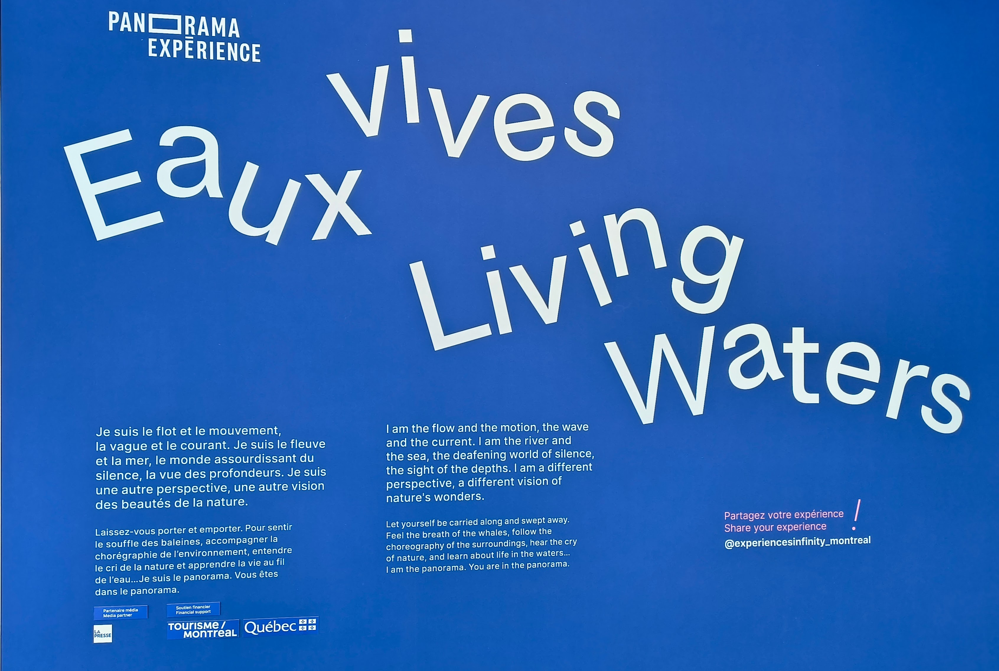 ! 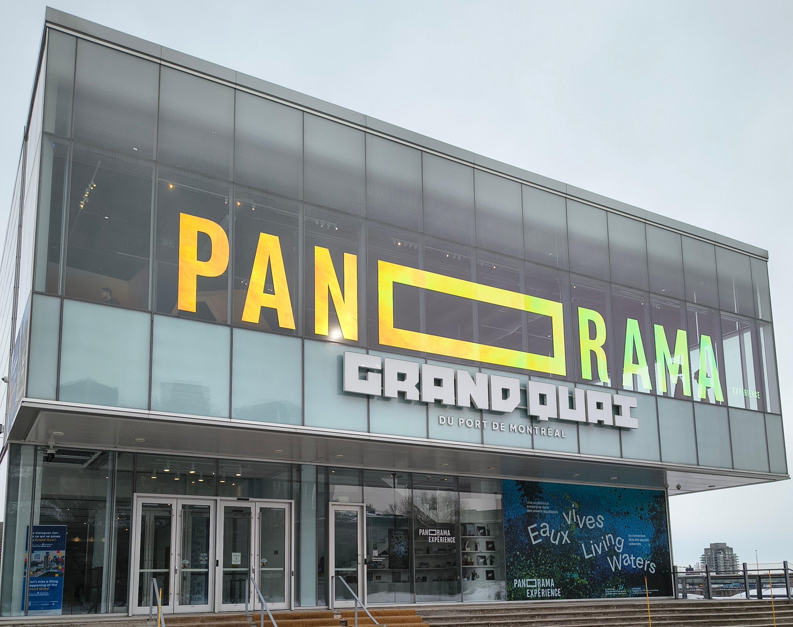

---

## Concept de l'exposition
L'exposition est conçue comme une immersion totale dans le monde aquatique, visant à sensibiliser le public à la fragilité des écosystèmes marins. Elle rassemble quatre artistes et collectifs de renommée internationale :

**Marshmallow Laser Feast (MLF) :** Présente *Échos de l'esprit de la Baleine*, une œuvre qui utilise le son spatialisé pour nous faire "voir" l'océan comme un cétacé.
**Maxwel Hohn :** Présente *Têtards : La Grande Petite Odyssée*, un film documentaire immersif qui suit la migration spectaculaire de millions de têtards en Colombie-Britannique.
**Maryse Goudreau :** Une artiste québécoise qui explore l'histoire sociale et politique des bélugas du Saint-Laurent à travers des archives et des photographies.
**Mandy Barker :** Une série photographique intitulée *Notre océan de plastique*, qui transforme des déchets récupérés en mer en compositions esthétiques pour dénoncer la pollution.

### Pourquoi cette exposition est marquante
L'exposition se distingue par son approche **Art-Science**. Chaque œuvre est basée sur des données réelles (données acoustiques, recherches biologiques, archives historiques). Pour un futur développeur ou créateur multimédia, c'est un exemple parfait de la manière dont on peut utiliser :
1.  **Le son spatialisé** pour créer une immersion sans interaction physique.
2.  **La visualisation de données (Data Viz)** pour rendre l'invisible perceptible.
3.  **La scénographie numérique** pour transformer un espace public (le port) en un lieu de réflexion environnementale.

---

# Oeuvre choisie

## Échos de l'esprit de la Baleine — Marshmallow Laser Feast

**Artiste :** Marshmallow Laser Feast (MLF).
**Année de réalisation :** 2024.

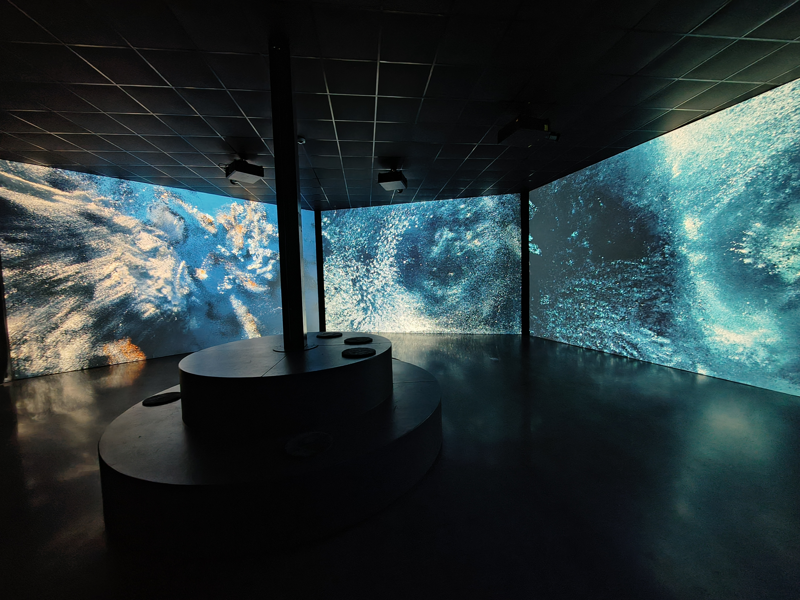

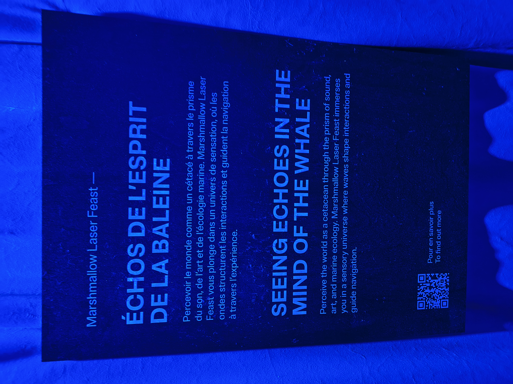

---

## Description de l'œuvre

Cette installation vidéo de grande envergure explore le monde sensoriel des cétacés et célèbre la diversité des formes de vie océaniques. L'expérience propose une immersion multisensorielle qui renforce notre connexion au monde marin en combinant l'expression artistique et les connaissances scientifiques.

L'œuvre suit spécifiquement le parcours de trois espèces:
Le grand dauphin.
]La baleine à bosse.
Le cachalot.

À chaque fois qu'un animal remonte à la surface pour respirer, la perspective visuelle se transforme. Cela permet au public de découvrir l'environnement à travers les sens uniques de ces animaux, mettant en lumière leur perception du monde.

Échos de l’esprit de la Baleine est une installation vidéo de grande envergure 
qui explore le monde sensoriel des cétacés. Elle célèbre la multitude de formes 
de vie qui peuplent les océans de notre planète. En combinant données d’écoute 
profonde, connaissances scientifiques et expression artistique, l’œuvre propose une expérience multisensorielle qui illustre et renforce notre connexion au monde marin. La pièce suit le parcours de trois espèces principales: le grand dauphin, la baleine à bosse et le cachalot. Chacune remonte à la surface pour reprendre son souffle avant de replonger dans les profondeurs. À chaque respiration, la perspective se transforme, permettant au public de découvrir leur environnement à travers les yeux et les sens de ces animaux extraordinaires. Ce jeu de points de vue met en lumière les façons uniques dont ces espèces perçoivent le monde qui les entoure. Le projet cherche à combler l’écart entre la perception humaine et les capacités sensorielles remarquables des baleines, notamment leur relation complexe au son. Grâce à leurs vocalisations, elles peuvent parcourir de grandes distances, communiquer par des appels sophistiqués et interagir avec leur environnement d’une manière qui dépasse largement nos propres sens.

---

## Type d'installation

L'installation est immersive mais également contemplative, car Les sorties vidéo et audio multi-canaux qui en résultent sont rendues en une installation immersive, nous permettant d’entrevoir ce que cela peut faire de « voir » à travers le son, comme le font les baleines.

(**Pour la vue d'ensemble, réferez-vous à l'image dans Oeuvre choisie**)

---

## Fonction du dispositif multimédia

L’œuvre suit les parcours de trois principales espèces : un dauphin à gros nez, une baleine à bosse et un cachalot. Chacune de ces créatures prend une inspiration à la surface de l’eau avant de replonger dans le bleu profond. À chaque respiration, la perspective change, permettant aux spectateurs de découvrir le monde à travers les yeux et les sens de ces animaux extraordinaires. À travers ce prisme changeant, l’installation met en lumière les manières uniques dont ces espèces perçoivent leur environnement. Le monde sonore du projet repose principalement sur des vocalisations brutes de baleines, principalement fournies par l’Institut de recherche de l’Aquarium de la baie de Monterey et le Laboratoire de Bioacoustique Appliquée de l’Université Polytechnique de Catalogne. L’élément visuel est construit à l’aide d’un pipeline d’IA générative personnalisé conçu pour extraire des éléments des images sous-marines telles que des coraux, des dauphins, des baleines à bosse, des cachalots et d’autres éléments marins, en les segmentant et en reconstruisant les données volumétriques pour chaque scène. Cela nous a permis de fusionner des sources vidéo disparates en un monde sous-marin cohérent et immersif.

---

## Mise en espace

La mise en espace de l’œuvre repose sur un dispositif immersif multi-écrans et multicanal, disposé de manière panoramique autour du spectateur. Le visiteur est placé au centre d’un environnement audiovisuel évolutif qui reproduit la perception sensorielle des cétacés et l’immerge dans un paysage océanique sonore et visuel. Également, l'exposition nous montre un plan assez détaillé de ses différents espaces pour bien se situer et de voir concrètement ce qui nous attend au fil de l'exposition.

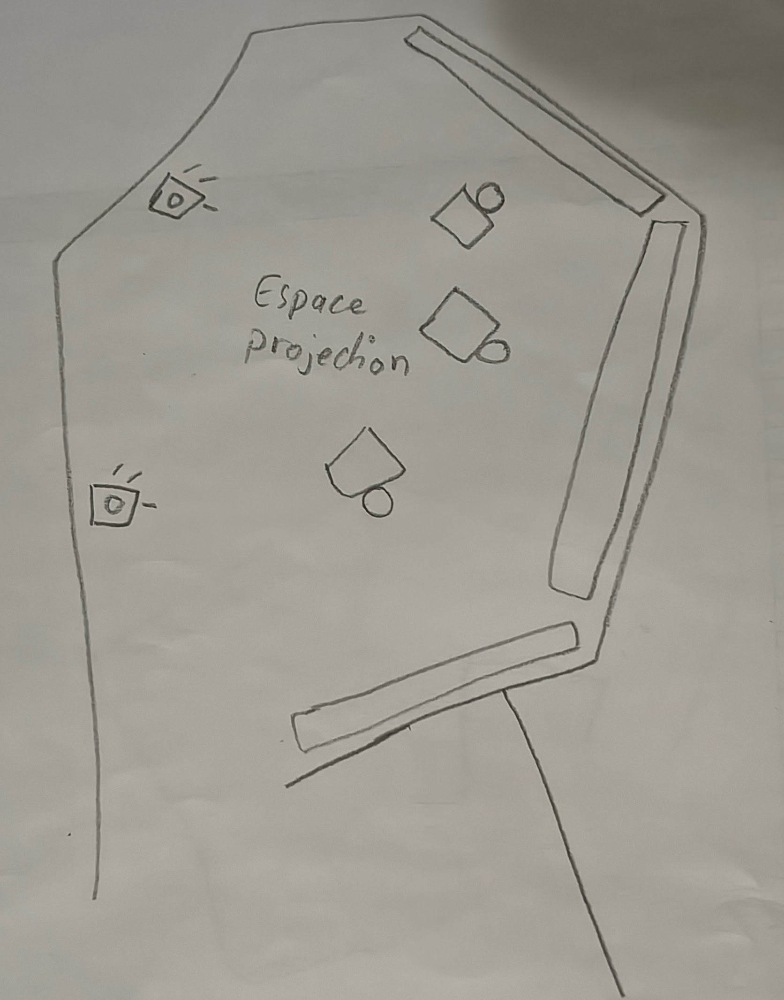

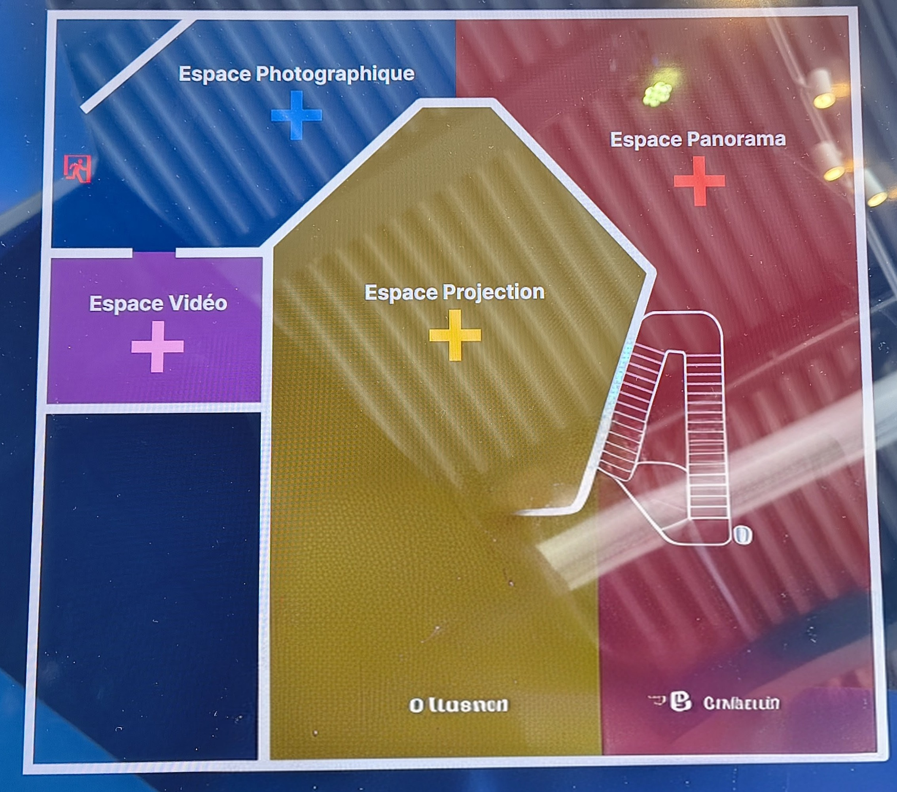

---

## Composantes et techniques
Le dispositif repose sur une fusion de plusieurs domaines techniques et scientifiques :
**Données d'écoute profonde :** Utilisation de données réelles pour structurer l'environnement sonore et visuel.
**Vocalisations :** L'œuvre illustre comment les baleines utilisent des appels sophistiqués pour communiquer et naviguer sur de grandes distances.
**Imagerie contemporaine :** Le collectif fusionne des outils architecturaux et des techniques d'imagerie pour sculpter des espaces numériques.
**Perception sensorielle :** Le projet cherche à combler l'écart entre la perception humaine et les capacités sensorielles des baleines, notamment leur relation complexe au son.

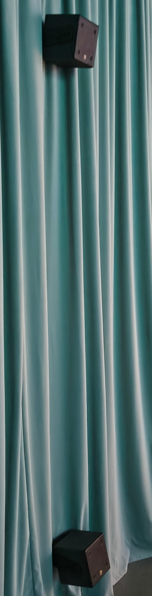

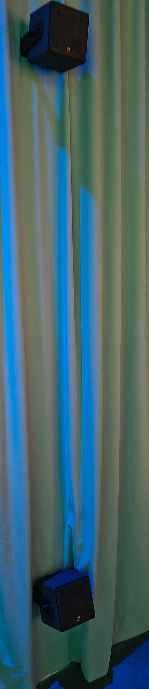

---

## Éléments nécessaires à la mise en exposition

Pour que l’installation fonctionne correctement dans l'espace d’exposition, plusieurs éléments sont nécessaires :

- Un espace où on peut s'asseoir et ressentir pleinement l'expérience de l'oeuvre
- Une lumière qui projette directement sur l'affiche de l'oeuvre
- Un système de projecteur qui projette l'oeuvre

  Ces éléments sont essentiels pour préserver le caractère immersif de l’oeuvre et assurer son bon fonctionnement technique.

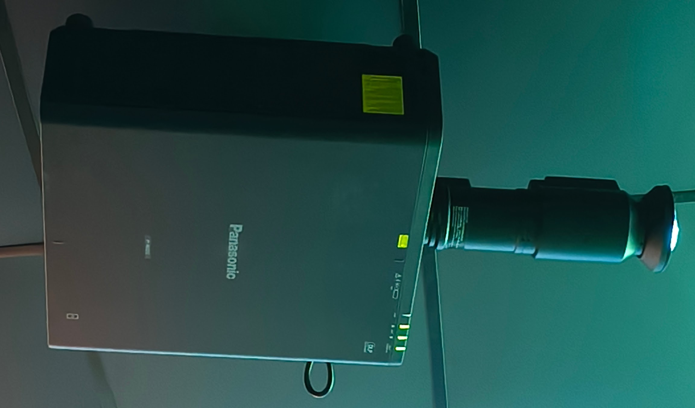

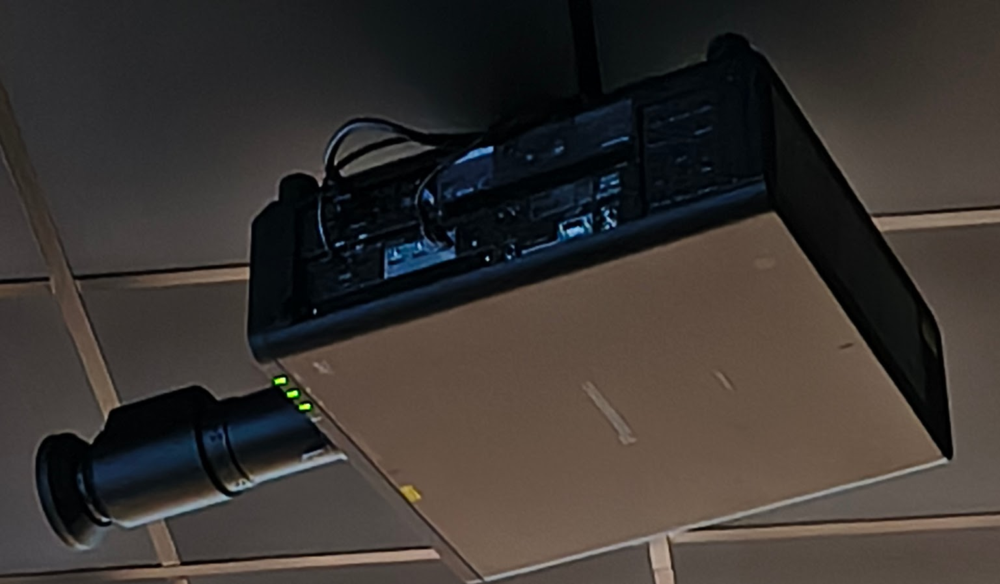

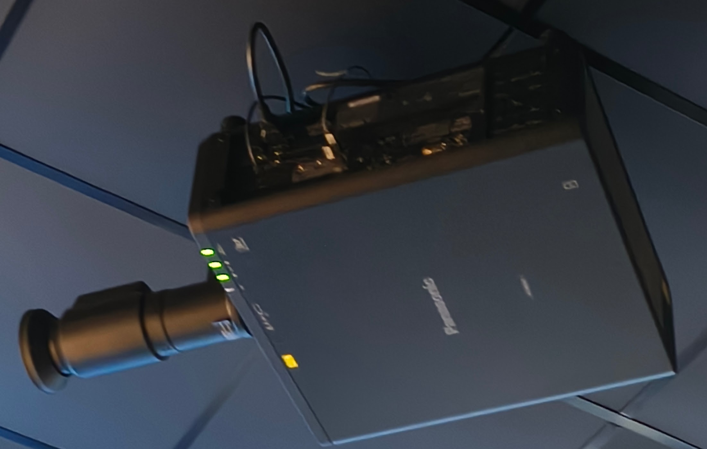

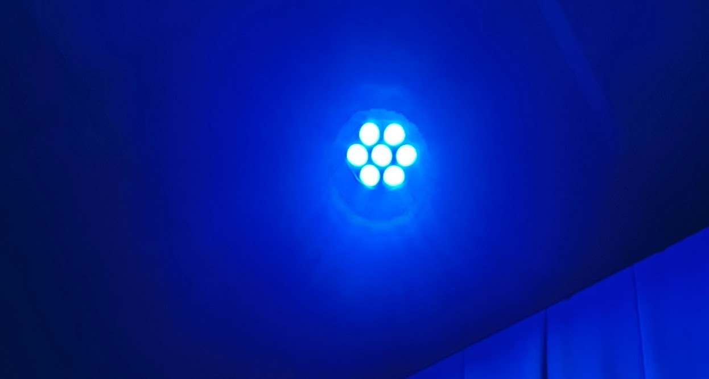

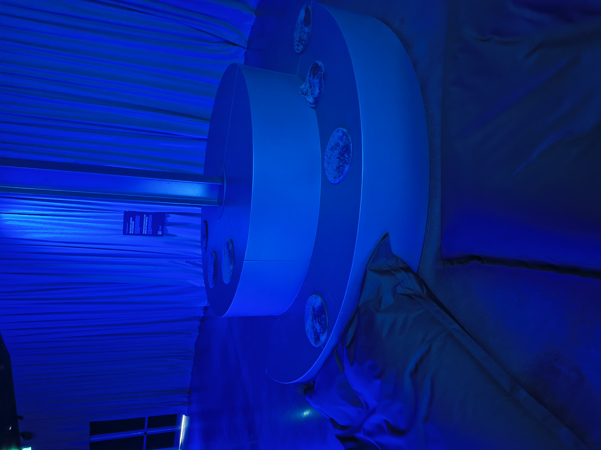

---

## À propos des artistes : Marshmallow Laser Feast (MLF)
Marshmallow Laser Feast est l'un des collectifs d'art immersif les plus influents au monde. Leur travail se concentre sur plusieurs piliers :
**Élargir la perception :** Ils explorent nos liens avec le monde naturel en révélant les forces invisibles qui nous entourent.
**Rigueur et jeu :** Leur approche est guidée par la rigueur scientifique tout en favorisant une exploration ludique.
**Systèmes sublimes :** Ils révèlent des réseaux et des systèmes essentiels à la vie sur Terre qui resteraient autrement imperceptibles à nos sens quotidiens.

---

## Expérience vécue
**Type d'installation :** Immersive et contemplative.
**Mise en espace :** Utilisation de trois écrans monumentaux créant un environnement enveloppant où le monde physique s'efface.
**Fonction du dispositif :** Mise en valeur du patrimoine naturel immatériel (sons des baleines) et support pédagogique sur l'écholocalisation.

---

## Ce qui m'a plu
L'esthétique des nuages de points (point clouds) est particulièrement marquante. Elle permet de visualiser l'invisible et offre une direction artistique fluide qui inspire la création d'environnements 3D dynamiques. Ce qui m'a plu de l'exposition, c'est qu'il y avait des panneaux d'informations sur un écran interactif sur le son, le Fleuve Saint-Laurent et sur le monde marin qui permettait d'en savoir plus sur ces 3 aspects et c'était effectivement intéressant.

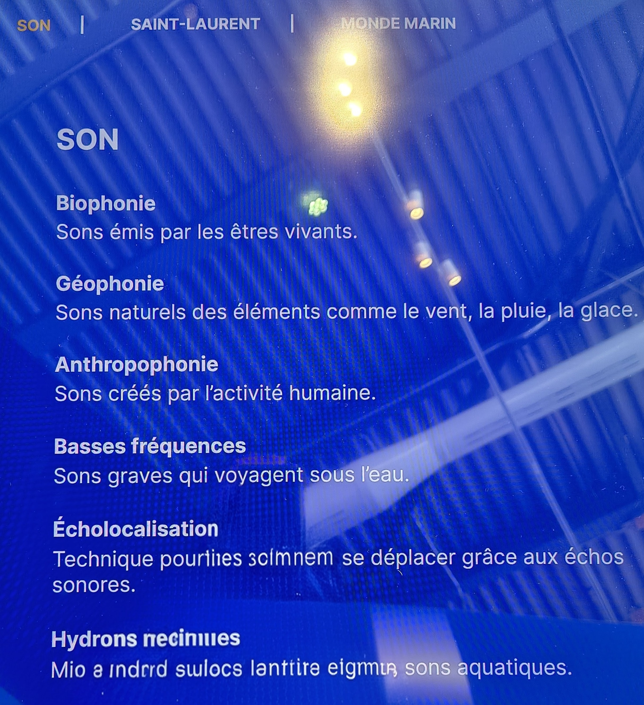

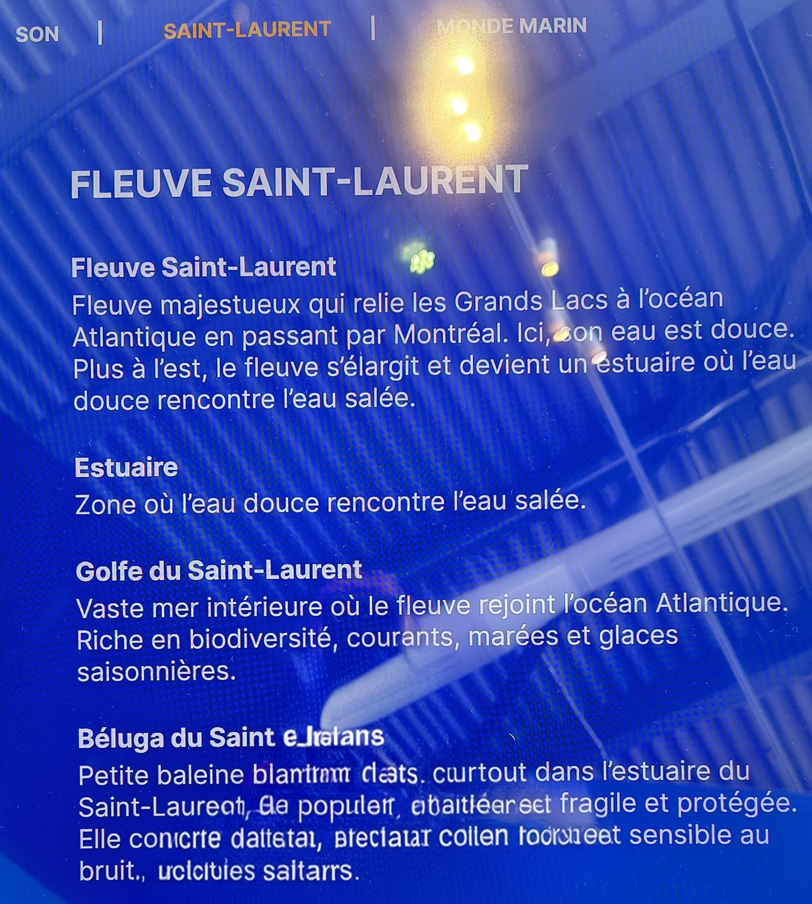

---

## Ce que je ferais autrement
Bien que l'immersion soit forte, l'ajout de vibrations au sol (retour haptique) synchronisées avec les fréquences des chants de baleines permettrait de "ressentir" physiquement le son, renforçant encore davantage l'aspect multisensoriel.

---

## Références
Photos : Vincent Quesnel
Exposition : Grand Quai du Port de Montréal
Artiste : Marshmallow Laser Feast.
Oeuvre : *Échos de l'esprit de la Baleine*
Liens consultés : [site créateur](https://marshmallowlaserfeast.com/project/seeing-echoes-in-the-mind-of-the-whale/)
[info exposition](https://feverup.com/m/517639?cp_landing_source=infinity-experiences&utm_source=newsletter&utm_medium=email&utm_campaign=batir_phi_contemporain_episode_1_l_idee&utm_term=2026-02-09)
[info oeuvre](https://infinity-experiences.com/uploads/PDF-Uploads/Panorama_EauxVives_CartelsNumeriqeus_MLF.pdf)
